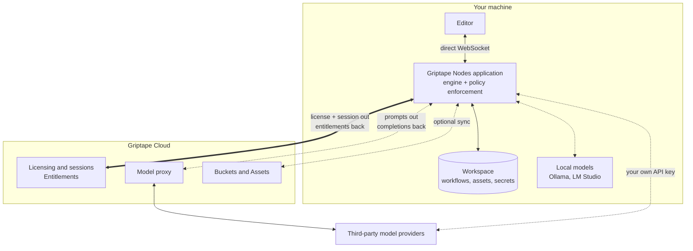
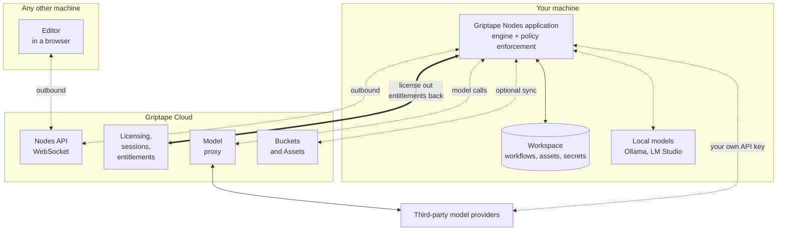
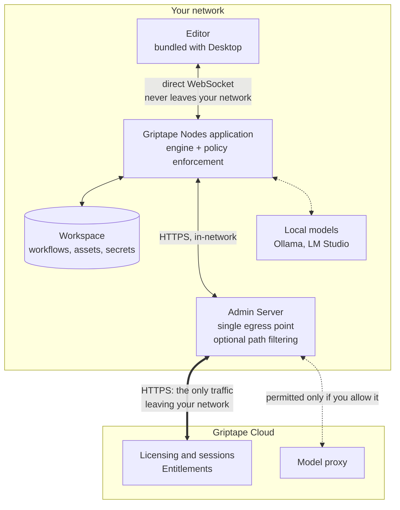

# Architecture

Griptape Nodes is two programs: an **editor** where you build workflows, and an **application** that executes them on a machine you control. The application does the work, holds the data, and calls out to Griptape Cloud for the few things it cannot do itself.

That shape does not change between deployments. What changes is the network path from your machines to Griptape Cloud:

- **[SaaS configuration](#saas-configuration)** is the default. Your machine reaches Griptape Cloud directly.
- **[On-premises configuration](#on-premises-configuration)** keeps your machines off the public internet. They reach Griptape Cloud only through a single [Admin Server](enterprise/admin_server.md) you run.

Both run identical software. Moving between them changes a route, not a product.

## The pieces

| Component       | What it is                                                                                                                                                                                                                                                             | Where it runs                                              |
| --------------- | ---------------------------------------------------------------------------------------------------------------------------------------------------------------------------------------------------------------------------------------------------------------------- | ---------------------------------------------------------- |
| **Editor**      | The visual canvas where you build workflows.                                                                                                                                                                                                                           | In your browser, or bundled inside Griptape Nodes Desktop. |
| **Application** | The program that runs your workflows, distributed as [`griptape-nodes`](https://pypi.org/project/griptape-nodes/). It executes the graph, manages your workspace, and enforces the permissions your license grants.                                                    | On your machine.                                           |
| **Engine**      | The open source workflow runtime, distributed as [`griptape-nodes-engine`](https://pypi.org/project/griptape-nodes-engine/) with source at [griptape-nodes-engine](https://github.com/griptape-ai/griptape-nodes-engine). Loads node libraries and executes the graph. | Inside the application.                                    |

The engine is where workflow execution actually happens, and it is fully open source, so anything you want to verify about how a workflow runs or where it writes files is auditable. It is not a separate deployment target: an editor connects to the application, never to the engine directly.

[Griptape Nodes Desktop](installation.md#griptape-nodes-desktop-recommended) bundles the editor and ships the application with a pinned Python interpreter, so there is nothing to install separately.

## Where your data lives

Almost everything you create is written to your **workspace**: a single root directory that the application reads and writes, and from which relative paths are resolved. Its location is yours to choose. It defaults to a folder beside the application, but you can point it anywhere the machine can reach, including network attached storage such as a NAS mount or LucidLink, which is a common arrangement for studios that keep project data on shared infrastructure. See [Workspace](guides/projects/workspace.md).

That makes the workspace the thing to look at when you are asking where data goes. The application writes to the path you configured, and nothing in this table is sent to Griptape Cloud by default.

| What                                   | Where it lives                                                                                      | Sent to Griptape Cloud?                                     |
| -------------------------------------- | --------------------------------------------------------------------------------------------------- | ----------------------------------------------------------- |
| Workflows and project files            | Your workspace                                                                                      | No                                                          |
| Generated assets: images, video, audio | Your workspace                                                                                      | No, unless you switch the storage backend to Griptape Cloud |
| Secrets and API keys                   | Environment variables, then a `.env` file in your workspace, then one in your user config directory | No                                                          |
| Conversation history                   | Your workspace                                                                                      | No                                                          |
| Node libraries                         | Installed on the machine running the application, each in its own virtual environment               | No                                                          |

Two settings can change this, both off by default and both documented in [Configuration](guides/configuration.md):

- **Storage backend.** Defaults to `local`, which writes assets to your workspace. Set it to `gtc` and generated assets go to a Griptape Cloud bucket instead.
- **Synced workflows.** Opt in to sync workflows through a Griptape Cloud bucket to share them across machines.

Beyond those, data leaves the workspace only where a workflow sends it: a node that calls a model provider sends that node's inputs to that provider. Which is the next section.

## What talks to Griptape Cloud

The application depends on Griptape Cloud for a small number of things. This is the complete list.

| Capability                 | Required?                                         | What crosses the boundary                                                                                    |
| -------------------------- | ------------------------------------------------- | ------------------------------------------------------------------------------------------------------------ |
| **Licensing and sessions** | **Yes.** The application will not run without it. | Your license, and session allocate, renew, and release calls. No workflow content.                           |
| **Entitlements**           | Yes, resolved with the session                    | The permissions your license grants, returned to the application, which enforces them locally                |
| **Model proxy**            | No                                                | The prompts and inputs of nodes you point at it, forwarded to the model provider                             |
| **Buckets and Assets**     | No, opt in                                        | Assets and workflows you choose to sync                                                                      |
| **Nodes API WebSocket**    | No                                                | Editor and application events, when the two are not on the same machine                                      |
| **Admin Dashboard**        | No, administrators only                           | License and permission administration, from a browser. See [Admin Dashboard](enterprise/admin_dashboard.md). |

**Licensing is the only hard dependency.** A license is what permits the application to run: the application validates it, asks Griptape Cloud to allocate a session, receives the permissions attached to it, and enforces those locally while it runs. Workflow content is never part of that exchange. See [Using the Admin Server](enterprise/using_the_admin_server.md) for activation.

Model calls do not have to involve Griptape Cloud at all. You can point nodes at a third party provider with your own API key, or at a model running locally under Ollama or LM Studio, in which case prompts never leave the machine. See [AI Providers](guides/agent/providers/index.md).

### How the editor reaches the application

The editor and the application are separate programs, so events between them need a transport:

- **Direct WebSocket.** The application listens locally and the editor connects straight to it. Events never leave the machine. This is what Griptape Nodes Desktop uses when you activate with a license.
- **Nodes API WebSocket.** The editor and the application each open their own outbound connection to Griptape Cloud, which relays events between them. This is what lets an editor in a browser drive an application on a different machine.

The distinction matters for privacy, because editor traffic carries workflow content: node graphs, parameter values, and previews of generated assets. On the direct WebSocket none of it is exposed to the network. Either way your workspace stays on the machine that runs the workflows. The [SaaS configuration](#saas-configuration) section below draws both arrangements.

## SaaS configuration

The default. Your machine reaches Griptape Cloud directly, so nothing needs to be deployed on your side. This configuration comes in two variations, which differ only in how the editor reaches the application.

In all three diagrams on this page, solid lines are required and dotted lines are optional, and a double headed arrow means data comes back along the same path. The only traffic Griptape Nodes cannot run without is licensing.

### Editor and engine on the same machine

The arrangement you get from Griptape Nodes Desktop. The editor connects straight to the application that hosts the engine, so no workflow content touches the network.

### Editor and engine on different machines

Use this when you want the engine on a bigger box than the one you are sitting at, or the editor in a browser on a laptop. The editor and the application each open an **outbound** connection to the Nodes API WebSocket, which relays events between them.

Both sides dial out, so this arrangement needs no open inbound port, and neither machine needs to know the other's address. The trade is that editor traffic now crosses the internet: node graphs, parameter values, and asset previews pass through Griptape Cloud. Your workspace does not move, and the workflow still runs on the machine hosting the engine.

**Neither variation applies on premises.** The Nodes API WebSocket is a Griptape Cloud service, so an on-premises deployment uses the direct connection, which is what keeps workflow events inside your network.

## On-premises configuration

Your machines have no route to the public internet. They reach Griptape Cloud through an [Admin Server](enterprise/admin_server.md) you run inside your network, so you allow one host through your firewall instead of one per machine.

Three properties carry the configuration.

**Nothing about building or running a workflow crosses the perimeter.** Griptape Nodes Desktop bundles the editor, so no browser fetches it over the internet, and it connects to the application over the direct WebSocket. Workflows, assets, and secrets sit in a workspace on the machine. Combined with a local model runner, a workflow can execute start to finish with no packet leaving your network.

**One host egresses, and you decide what it may carry.** Every application points at the Admin Server instead of `cloud.griptape.ai`, giving you one firewall rule and one place to audit outbound traffic. The Admin Server can also restrict which Cloud paths are permitted, so you can keep model calls in network while still permitting licensing. See [forwarding rules](enterprise/admin_server.md#forwarding).

**What must egress is a fixed, inspectable list.** Licensing needs the routes below, and nothing else is required. The Admin Server refuses to start if your configuration would block them:

| Route                  | Why it is needed                                                     |
| ---------------------- | -------------------------------------------------------------------- |
| `/api/sessions/*`      | Allocate and manage the session that permits the application to run. |
| `/api/session-renew`   | Keep that session alive.                                             |
| `/api/session-release` | End the session cleanly and free the seat.                           |
| `/api/users`           | Identify the license holder at startup and on each heartbeat.        |
| `/api/organizations`   | Resolve the owning organization at startup and on each heartbeat.    |

!!! note "Why the Cloud connection is worth having"

    That connection does more than allocate a session. It is also how an application picks up the current contents of its license, so when an administrator changes what a license permits, running deployments get the new permissions on their next session rather than waiting for a reissue or a redeploy. Managing entitlements centrally and having them take effect immediately is the practical benefit of keeping the route open.

    It does mean on premises is not a disconnected mode. On premises means your machines, workflows, and assets stay inside your network; it does not mean Griptape Nodes runs with no route out. Sessions are allocated by Griptape Cloud, so the Admin Server needs to reach it. If that route is unavailable, the Admin Server returns an error rather than serving stale approvals, and applications cannot start new sessions.

## Where the boundaries are

If you are reviewing Griptape Nodes for a security assessment, these are the details that matter most.

**The Admin Server forwards; it does not decide.** It validates no licenses, allocates no sessions, resolves no entitlements, and caches nothing. It does not authenticate callers either: each application's own credential is forwarded untouched for Griptape Cloud to accept or reject. Its jobs are egress consolidation and, if you configure it, egress filtering. It holds no state, so it is not an offline fallback. With no route upstream, it returns an error.

**Policy is enforced on your machine, not in the network.** The application enforces the permissions attached to your license locally, before a request reaches the engine. Those permissions come from the signed license and are resolved from Griptape Cloud when a session is allocated, so no network appliance or firewall rule is involved in deciding what a workflow may do.

**Griptape Cloud is the authority on licensing and entitlement.** Session allocation and entitlement resolution are Cloud decisions in both configurations. On premises changes only the path traffic takes to get there.

**The execution runtime is open source and auditable.** The engine that runs your workflows is public, so its file handling, network calls, and node execution can be inspected rather than taken on trust. Enforcement lives in the application layer above it.

## Related pages

- [Installation](installation.md) covers installing Desktop or the application by hand.
- [Configuration](guides/configuration.md) covers the workspace, storage backend, and static server settings.
- [Assets and Outputs](guides/assets.md) explains where generated files go and how the editor previews them.
- [Using the Admin Server](enterprise/using_the_admin_server.md) walks through activating with a license key.
- [Admin Server](enterprise/admin_server.md) covers deploying and configuring the on-premises proxy.
- [Admin Dashboard](enterprise/admin_dashboard.md) covers issuing license keys and building permission templates.
