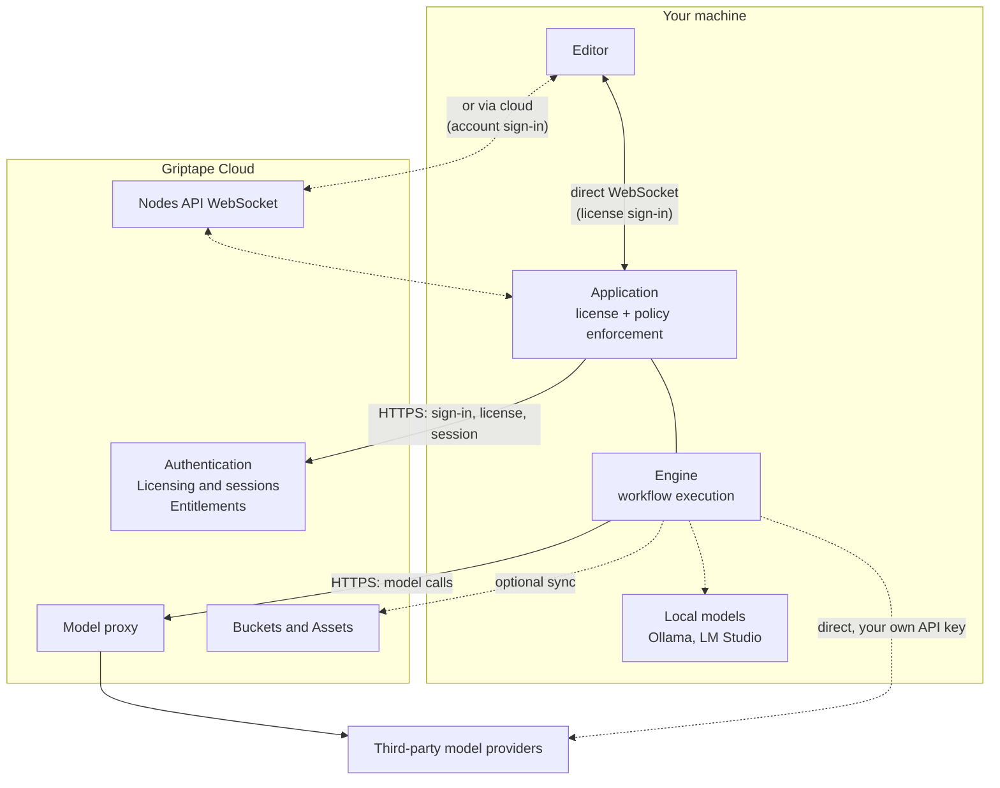
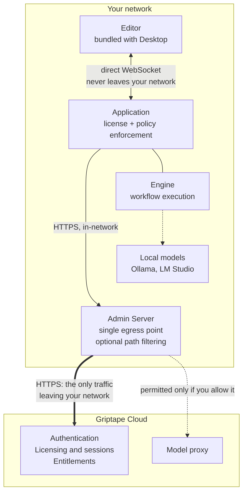

# Architecture

Griptape Nodes runs the same way everywhere. You build workflows in an editor, and an engine on a machine you control executes them. What changes between setups is how you sign in, how the editor reaches the engine, and whether your machines talk to Griptape Cloud directly or through a server you operate.

This page covers the two configurations available today:

- **[SaaS configuration](#saas-configuration)** is the default. Your machines talk to Griptape Cloud directly.
- **[On-premises configuration](#on-premises-configuration)** keeps your machines off the public internet. They reach Griptape Cloud only through a single [Admin Server](enterprise/admin_server.md) you run.

Both configurations run identical software. Moving between them is a matter of configuration, not a different product.

## The pieces

Three things sit between you and a running workflow.

| Component       | What it is                                                                                                                                                                                                            | Where it runs                                              |
| --------------- | --------------------------------------------------------------------------------------------------------------------------------------------------------------------------------------------------------------------- | ---------------------------------------------------------- |
| **Editor**      | The visual canvas where you build workflows.                                                                                                                                                                          | In your browser, or bundled inside Griptape Nodes Desktop. |
| **Application** | The licensed program you launch, distributed as [`griptape-nodes`](https://pypi.org/project/griptape-nodes/). It wraps the engine and enforces your license: which libraries you may load, which models you may call. | On your machine.                                           |
| **Engine**      | The open source workflow executor, distributed as [`griptape-nodes-engine`](https://pypi.org/project/griptape-nodes-engine/). Loads node libraries, runs workflows, writes results to your workspace.                 | Inside the application, on your machine.                   |

[Griptape Nodes Desktop](installation.md#griptape-nodes-desktop-recommended) is the easiest way to get all three: it bundles the editor and ships the application with a pinned Python interpreter, so there is nothing to install separately.

Griptape Cloud provides the services the application cannot provide for itself:

| Capability                 | What it does                                                                                                                              |
| -------------------------- | ----------------------------------------------------------------------------------------------------------------------------------------- |
| **Authentication**         | Signs you in and identifies your organization.                                                                                            |
| **Licensing and sessions** | Issues licenses, allocates and renews the session that permits an application to run, then releases it when you are done.                 |
| **Entitlements**           | Resolves the permissions attached to your license, which the application then enforces locally.                                           |
| **Nodes API WebSocket**    | Carries events between an editor and an application that are not on the same machine.                                                     |
| **Model proxy**            | Routes model calls to many providers under one Griptape credential, so you need no per provider accounts.                                 |
| **Buckets and Assets**     | Optional cloud storage for syncing workflows and assets across machines.                                                                  |
| **Admin Dashboard**        | Backs the interface where owners issue license keys and build permission templates. See [Admin Dashboard](enterprise/admin_dashboard.md). |

Model calls can also bypass Griptape Cloud entirely. You can point nodes at a third party provider with your own API key, or at a local model runner such as Ollama or LM Studio. See [AI Providers](guides/agent/providers/index.md).

## Two choices that shape your setup

Before the diagrams, two settings are worth separating, because they are independent and each is often mistaken for the other.

### How you sign in

There are two ways to authenticate, and both work in either configuration:

- **Griptape Cloud account.** You sign in through Griptape Cloud, and your account identifies you.
- **License key.** You paste a license key issued by your organization and point the application at a server endpoint. No cloud account is involved. See [Using the Admin Server](enterprise/using_the_admin_server.md).

License keys are what on-premises deployments normally use, but nothing stops you from activating with a license against Griptape Cloud directly.

### How the editor reaches the application

The editor and the application are separate programs, so events between them need a transport. Two are available:

- **Direct WebSocket.** The application listens on your machine and the editor connects straight to it. Events never leave the machine.
- **Nodes API WebSocket.** Both sides connect out to Griptape Cloud, which passes events between them. This is what lets you open an editor on a laptop and drive an application running somewhere else.

**The transport follows how you signed in.** Griptape Nodes Desktop configures the direct WebSocket when you activate with a license key, and the Nodes API WebSocket when you sign in with a Griptape Cloud account. So the choice in the previous section decides this one.

## SaaS configuration

This is the default setup, whether you installed Griptape Nodes Desktop or the engine by hand. Your machine talks to Griptape Cloud directly.

Two things are worth noticing.

**Your workflows and assets stay on your machine.** The engine reads and writes your local workspace. Nothing is copied to Griptape Cloud unless you opt into Buckets and Assets, or a node you placed sends data somewhere.

**Either transport is available here.** The dotted path through the Nodes API WebSocket is what you get with an account sign-in. Activate with a license key instead and the editor connects straight to the application, exactly as it does on premises.

## On-premises configuration

In this setup your machines have no route to the public internet. They reach Griptape Cloud only through an [Admin Server](enterprise/admin_server.md) you run inside your network, so you allow one host through your firewall instead of one per machine.

Three differences carry the whole configuration.

**Everything about the editor is local.** Griptape Nodes Desktop bundles the editor, so no browser fetches it over the internet. Users activate with a license key, which puts the editor on the direct WebSocket, so workflow events never leave your network.

**One host egresses, and you decide what it may carry.** Every application points at the Admin Server instead of `cloud.griptape.ai`. You get one firewall rule and one place to audit outbound traffic. The Admin Server can also restrict which Cloud paths may leave. You might keep model calls in network while still permitting licensing. See [forwarding rules](enterprise/admin_server.md#forwarding).

**Local models never egress at all.** A model running under Ollama or LM Studio on the same machine is reached without passing through the Admin Server.

### What has to leave your network

Even fully locked down, an application needs a small set of Cloud routes to run. These are the licensing and session routes, and the Admin Server refuses to start if your configuration would block them:

| Route                  | Why it is needed                                                     |
| ---------------------- | -------------------------------------------------------------------- |
| `/api/sessions/*`      | Allocate and manage the session that permits the application to run. |
| `/api/session-renew`   | Keep that session alive.                                             |
| `/api/session-release` | End the session cleanly and free the seat.                           |
| `/api/users`           | Identify the license holder at startup and on each heartbeat.        |
| `/api/organizations`   | Resolve the owning organization at startup and on each heartbeat.    |

Everything else is your choice. Model calls can go through the Cloud model proxy, direct to a third party provider, or to a local model runner that never leaves your network.

!!! note "Griptape Cloud is still required"

    On premises means your machines, workflows, and assets stay inside your network. It does not mean Griptape Nodes runs disconnected. Sessions are allocated by Griptape Cloud, so the Admin Server needs a route to it. If that route is unavailable, the Admin Server returns an error rather than serving stale approvals, and applications cannot start new sessions.

## Where the boundaries are

If you are reviewing Griptape Nodes for a security assessment, these are the load bearing details.

**License enforcement happens on your machine, not in the network.** The application validates its license and enforces the attached policy locally, in compiled code, before a request reaches the engine. Policy comes only from the signed license, so it cannot be loosened by editing engine code. The permissions themselves are resolved from Griptape Cloud when a session is allocated.

**The Admin Server forwards; it does not decide.** It validates no licenses, allocates no sessions, resolves no entitlements, and caches nothing. It does not authenticate callers either: each application's own credential is forwarded untouched for Griptape Cloud to accept or reject. Its jobs are egress consolidation and, if you configure it, egress filtering. Because it holds no state, it is not an offline fallback. With no route upstream, it returns an error.

**Griptape Cloud remains the authority on identity and entitlement.** Authentication, session allocation, and entitlement resolution are Cloud decisions in both configurations. On premises changes only the path that traffic takes to get there.

**The engine is open source and unlicensed.** Enforcement lives in the application, not the engine. A workflow saved as a Python file can be run directly against the open source engine with no license, which also places it outside the policy boundary described above.

## Related pages

- [Installation](installation.md) covers installing Desktop or the engine by hand.
- [Admin Server](enterprise/admin_server.md) covers deploying and configuring the on-premises proxy.
- [Using the Admin Server](enterprise/using_the_admin_server.md) walks through activating with a license key.
- [Admin Dashboard](enterprise/admin_dashboard.md) covers issuing license keys and building permission templates.
- [Assets and Outputs](guides/assets.md) explains where generated files go and how the editor previews them.
- [Configuration](guides/configuration.md) covers workspace, storage backend, and static server settings.
