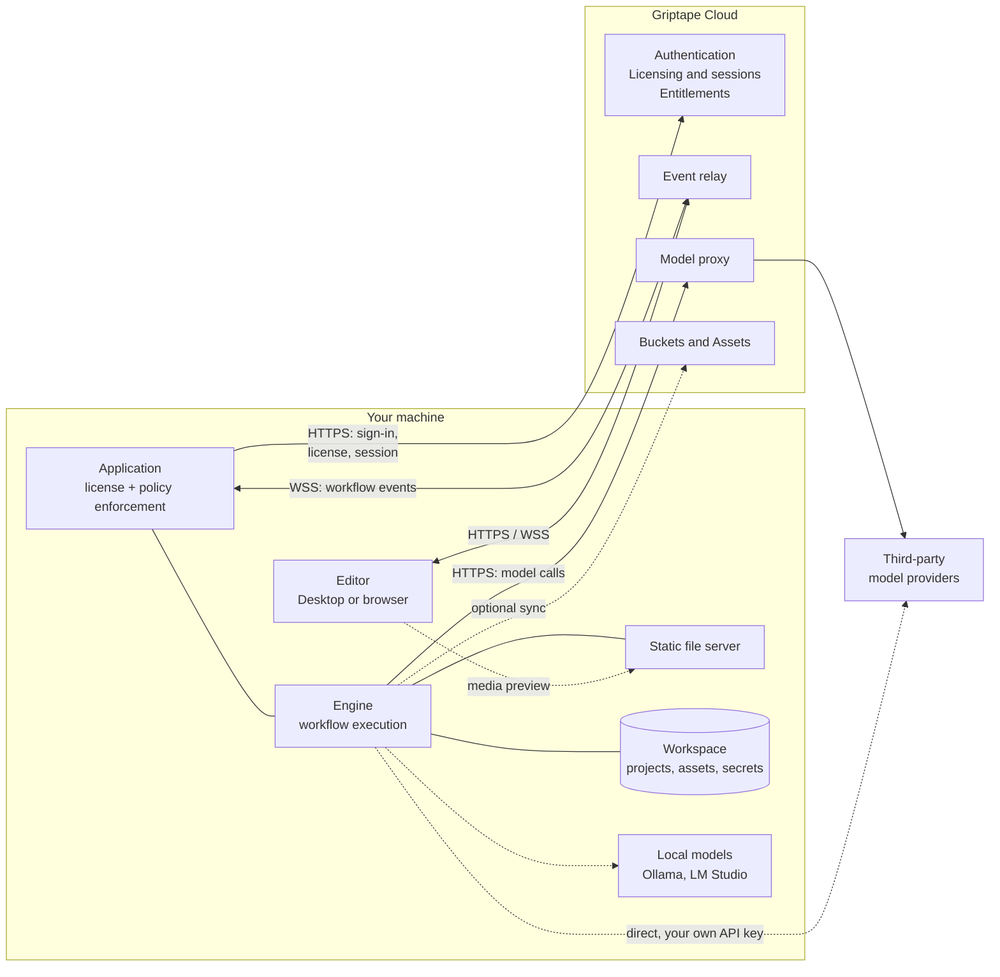
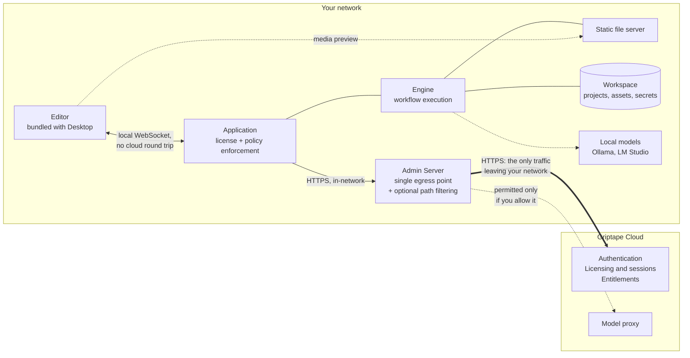

# Architecture

Griptape Nodes runs the same way everywhere: you build workflows in an editor, and an engine on a machine you control executes them. What changes between deployments is where that machine sits and how it reaches Griptape Cloud.

This page shows the two deployment models available today:

- **[Griptape Cloud](#griptape-cloud-deployment)** — the default. Your engine talks to Griptape Cloud directly.
- **[On-premises](#on-premises-deployment)** — your engines run inside your network with no direct internet access, reaching Griptape Cloud through a single [Admin Server](enterprise/admin_server.md) you operate.

Both models run identical software. Moving between them is configuration, not a different product.

## The pieces

Three things sit between you and a running workflow, and it helps to know which is which before reading the diagrams.

| Component       | What it is                                                                                                                              | Where it runs                                              |
| --------------- | --------------------------------------------------------------------------------------------------------------------------------------- | ---------------------------------------------------------- |
| **Editor**      | The visual canvas where you build workflows.                                                                                            | In your browser, or bundled inside Griptape Nodes Desktop. |
| **Application** | The licensed program you launch. It wraps the engine and enforces your license: what libraries you may load, which models you may call. | On your machine.                                           |
| **Engine**      | The open-source workflow executor. Loads node libraries, runs workflows, writes results to your workspace.                              | Inside the application, on your machine.                   |

Alongside the engine, two local services do supporting work:

- A **static file server** hands generated media (images, video, audio) to the editor for preview and download. See [Assets and Outputs](guides/assets.md).
- Your **workspace** on local disk holds your projects, workflow files, secrets, and generated assets.

Griptape Cloud provides the services the application cannot provide for itself:

| Capability                 | What it does                                                                                                                              |
| -------------------------- | ----------------------------------------------------------------------------------------------------------------------------------------- |
| **Authentication**         | Signs you in and identifies your organization.                                                                                            |
| **Licensing and sessions** | Issues licenses, allocates and renews the session that permits an application to run, and releases it when you are done.                  |
| **Entitlements**           | Resolves the permissions attached to your license — the policy the application enforces locally.                                          |
| **Model proxy**            | Routes model calls to many providers under one Griptape credential, so you need no per-provider accounts.                                 |
| **Buckets and Assets**     | Optional cloud storage for syncing workflows and assets across machines.                                                                  |
| **Event relay**            | Carries events between editor and engine when they are not on the same machine.                                                           |
| **Admin Dashboard**        | Backs the interface where owners issue license keys and build permission templates. See [Admin Dashboard](enterprise/admin_dashboard.md). |

Model calls can also bypass Griptape Cloud: you can point nodes at a third-party provider with your own API key, or at a local model runner such as Ollama or LM Studio. See [AI Providers](guides/agent/providers/index.md).

## Griptape Cloud deployment

This is what you get by default, whether you installed Griptape Nodes Desktop or the engine by hand.

Two things are worth noticing.

**Your workflows and assets stay on your machine.** The engine reads and writes your local workspace. Nothing is copied to Griptape Cloud unless you opt into Buckets and Assets, or a node you placed sends data somewhere.

**Editor and engine reach each other through the event relay.** They are separate programs, so events between them travel over Griptape Cloud by default. That is what lets you open the editor on a laptop and drive an engine running elsewhere. Media is the exception: the editor fetches previews straight from the local static file server, so large files never make the round trip.

## On-premises deployment

In this model your engines have no route to the public internet. They reach Griptape Cloud only through an [Admin Server](enterprise/admin_server.md) you run inside your network — one host through your firewall instead of one per instance.

Three differences from the cloud deployment carry the whole model.

**The editor is local, and so is its connection to the engine.** Griptape Nodes Desktop bundles the editor, so no browser needs to load it over the internet. Editor and application sit on the same workstation and talk over a local WebSocket. The cloud event relay is not used, so your workflow events never leave the building.

**One host egresses, and you choose what it may carry.** Every application instance points at the Admin Server instead of `cloud.griptape.ai`. You get one firewall rule and one place to audit outbound traffic. The Admin Server can also restrict *which* Cloud paths may leave — for example, keeping the model proxy in-network while still permitting licensing. See [forwarding rules](enterprise/admin_server.md#forwarding).

**Users activate with a license instead of signing in.** Rather than a Griptape Cloud login, each user pastes a license key and points the application at your Admin Server. See [Using the Admin Server](enterprise/using_the_admin_server.md).

### What has to leave your network

Even fully locked down, an application needs a small set of Cloud routes to run. These are the licensing and session routes, and the Admin Server refuses to start if your configuration would block them:

| Route                  | Why it is needed                                                     |
| ---------------------- | -------------------------------------------------------------------- |
| `/api/sessions/*`      | Allocate and manage the session that permits the application to run. |
| `/api/session-renew`   | Keep that session alive.                                             |
| `/api/session-release` | End the session cleanly and free the seat.                           |
| `/api/users`           | Identify the license holder at startup and on each heartbeat.        |
| `/api/organizations`   | Resolve the owning organization at startup and on each heartbeat.    |

Everything else is your choice. Model calls can go through the Cloud model proxy, direct to a third-party provider, or to a local model runner that never leaves your network.

!!! note "Griptape Cloud is still required"

    On-premises means your engines, workflows, and assets stay inside your network — not that Griptape Nodes runs disconnected. Sessions are allocated by Griptape Cloud, so the Admin Server needs a route to it. If that route is unavailable the Admin Server returns an error rather than serving stale approvals, and applications cannot start new sessions.

## Where the boundaries are

If you are reviewing Griptape Nodes for a security assessment, these are the load-bearing details.

**License enforcement happens on your machine, not in the network.** The application validates its license and enforces the attached policy locally, in compiled code, before a request reaches the engine. Policy comes only from the signed license, so it cannot be loosened by editing engine code. The permissions themselves are resolved from Griptape Cloud when a session is allocated.

**The Admin Server is a forwarder, not a decision-maker.** It does not validate licenses, allocate sessions, resolve entitlements, or cache anything, and it does not authenticate callers — each application's own credential is forwarded untouched for Griptape Cloud to accept or reject. Its jobs are egress consolidation and, if you configure it, egress filtering. Because it holds no state, it is not an offline fallback: with no route upstream, it returns an error.

**Griptape Cloud remains the authority on identity and entitlement.** Authentication, session allocation, and entitlement resolution are Cloud decisions in both deployment models. The difference on-premises is only the path traffic takes to get there.

**The engine is open source and unlicensed.** Enforcement lives in the application wrapper, not the engine. A workflow saved as a Python file can be run directly against the open-source engine with no license — which also means it is outside the policy boundary described above.

## Related pages

- [Installation](installation.md) — install Desktop or the engine by hand.
- [Admin Server](enterprise/admin_server.md) — deploy and configure the on-premises proxy.
- [Using the Admin Server](enterprise/using_the_admin_server.md) — activate a workstation with a license.
- [Admin Dashboard](enterprise/admin_dashboard.md) — issue license keys and build permission templates.
- [Assets and Outputs](guides/assets.md) — where generated files go and how the editor previews them.
- [Configuration](guides/configuration.md) — workspace, storage backend, and static server settings.
