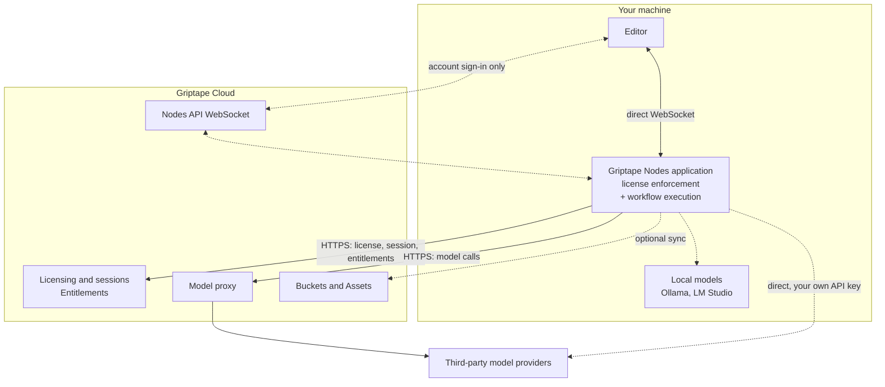
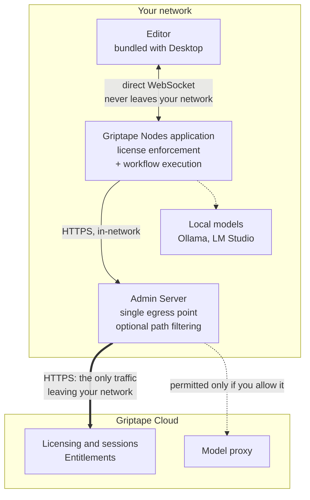

# Architecture

Griptape Nodes runs the same way everywhere. You build workflows in an editor, and an application on a machine you control executes them. A license is what unlocks that application, and Griptape Cloud is what validates the license.

That is the whole shape of it. The two configurations on this page differ in exactly one thing: **how the application's licensing checks reach Griptape Cloud.**

- **[SaaS configuration](#saas-configuration)** is the default. The application talks to Griptape Cloud directly.
- **[On-premises configuration](#on-premises-configuration)** keeps your machines off the public internet. They reach Griptape Cloud only through a single [Admin Server](enterprise/admin_server.md) you run.

Both run identical software, licensed the same way. Moving between them changes a route, not a product.

## The pieces

Two things sit between you and a running workflow.

| Component       | What it is                                                                                                                                                                                                              | Where it runs                                              |
| --------------- | ----------------------------------------------------------------------------------------------------------------------------------------------------------------------------------------------------------------------- | ---------------------------------------------------------- |
| **Editor**      | The visual canvas where you build workflows.                                                                                                                                                                            | In your browser, or bundled inside Griptape Nodes Desktop. |
| **Application** | The licensed program that runs your workflows, distributed as [`griptape-nodes`](https://pypi.org/project/griptape-nodes/). It validates your license, enforces the permissions attached to it, and executes the graph. | On your machine.                                           |

Inside the application is the open source [`griptape-nodes-engine`](https://pypi.org/project/griptape-nodes-engine/), which loads node libraries and does the actual execution. It is worth knowing about because it is public and auditable, but it is not a separate thing you deploy or connect to. An editor always connects to the application, never to the engine directly.

[Griptape Nodes Desktop](installation.md#griptape-nodes-desktop-recommended) is the easiest way to get both: it bundles the editor and ships the application with a pinned Python interpreter, so there is nothing to install separately.

Griptape Cloud provides the services the application cannot provide for itself:

| Capability                 | What it does                                                                                                                              |
| -------------------------- | ----------------------------------------------------------------------------------------------------------------------------------------- |
| **Licensing and sessions** | Validates licenses, allocates and renews the session that permits an application to run, then releases it when you are done.              |
| **Entitlements**           | Resolves the permissions attached to your license, which the application then enforces locally.                                           |
| **Nodes API WebSocket**    | Carries events between an editor and an application that are not on the same machine.                                                     |
| **Model proxy**            | Routes model calls to many providers under one Griptape credential, so you need no account with each provider.                            |
| **Buckets and Assets**     | Optional cloud storage for syncing workflows and assets across machines.                                                                  |
| **Admin Dashboard**        | Backs the interface where owners issue license keys and build permission templates. See [Admin Dashboard](enterprise/admin_dashboard.md). |

Model calls can also bypass Griptape Cloud entirely. You can point nodes at a third party provider with your own API key, or at a local model runner such as Ollama or LM Studio. See [AI Providers](guides/agent/providers/index.md).

## How a license unlocks the application

A license is issued to you by your organization and authenticates **the application itself**, not you as a person. Activating one is the same in both configurations described below:

1. You paste your license key into the application.
1. The application validates the key's signature locally, then asks Griptape Cloud to allocate a **session**, which is the permission slip that lets it run.
1. Griptape Cloud returns the **entitlements** attached to your license: which node libraries you may load, which models you may call.
1. The application enforces those entitlements locally for as long as it runs, renewing the session periodically.

Step 2 is the only step whose network path differs between the two configurations. Everything else is identical.

See [Using the Admin Server](enterprise/using_the_admin_server.md) for the activation walkthrough.

!!! info "If you signed in with a Griptape account instead"

    Individual users can also sign in with a Griptape Cloud account, which provisions credentials for you rather than using a license key. This is the older mechanism and it still works. Licenses are the direction the product is heading, and they are what organizations deploying Griptape Nodes should use, so this page describes the licensed path.

### How the editor reaches the application

The editor and the application are separate programs, so events between them need a transport. Two exist:

- **Direct WebSocket.** The application listens on your machine and the editor connects straight to it. Events never leave the machine. **This is what license activation uses.**
- **Nodes API WebSocket.** Both sides connect out to Griptape Cloud, which relays events between them. This is what lets you open an editor on a laptop and drive an application running on a different machine. It is tied to the account sign-in path above.

So on a licensed application, your workflow events are local by construction, in either configuration. Griptape Nodes Desktop wires this up for you: activate with a license and it configures the direct WebSocket.

## SaaS configuration

The default. Your machine reaches Griptape Cloud directly, so licensing works with no infrastructure of your own.

Two things are worth noticing.

**Your workflows and assets stay on your machine.** The application reads and writes your local workspace. Nothing is copied to Griptape Cloud unless you opt into Buckets and Assets, or a node you placed sends data somewhere.

**Only licensing has to go to Griptape Cloud.** The dotted paths are all optional. Model calls can go direct to a provider or to a local runner, asset sync is opt in, and the Nodes API WebSocket is only involved on the account sign-in path.

## On-premises configuration

Same licensing flow, different route. Your machines have no path to the public internet, so they reach Griptape Cloud through an [Admin Server](enterprise/admin_server.md) you run inside your network. You allow one host through your firewall instead of one per machine.

Three differences carry the whole configuration.

**Everything about the editor is local.** Griptape Nodes Desktop bundles the editor, so no browser fetches it over the internet, and license activation puts it on the direct WebSocket. Workflow events never leave your network.

**One host egresses, and you decide what it may carry.** Every application points at the Admin Server instead of `cloud.griptape.ai`. You get one firewall rule and one place to audit outbound traffic. The Admin Server can also restrict which Cloud paths may leave, so you might keep model calls in network while still permitting licensing. See [forwarding rules](enterprise/admin_server.md#forwarding).

**Local models never egress at all.** A model running under Ollama or LM Studio on the same machine is reached without passing through the Admin Server.

### What has to leave your network

Even fully locked down, an application needs a small set of Cloud routes to license itself. The Admin Server refuses to start if your configuration would block them:

| Route                  | Why it is needed                                                     |
| ---------------------- | -------------------------------------------------------------------- |
| `/api/sessions/*`      | Allocate and manage the session that permits the application to run. |
| `/api/session-renew`   | Keep that session alive.                                             |
| `/api/session-release` | End the session cleanly and free the seat.                           |
| `/api/users`           | Identify the license holder at startup and on each heartbeat.        |
| `/api/organizations`   | Resolve the owning organization at startup and on each heartbeat.    |

Everything else is your choice. Model calls can go through the Cloud model proxy, direct to a third party provider, or to a local model runner that never leaves your network.

!!! note "Griptape Cloud is still required"

    On premises means your machines, workflows, and assets stay inside your network. It does not mean Griptape Nodes runs disconnected. Sessions are allocated by Griptape Cloud, so the Admin Server needs a route to it. If that route is unavailable, the Admin Server returns an error rather than serving stale approvals, and applications cannot start new sessions.

## Where the boundaries are

If you are reviewing Griptape Nodes for a security assessment, these are the load bearing details.

**License enforcement happens on your machine, not in the network.** The application validates its license and enforces the attached policy locally, in compiled code, before a request reaches the engine. Policy comes only from the signed license, so it cannot be loosened by editing engine code. The permissions themselves are resolved from Griptape Cloud when a session is allocated.

**The Admin Server forwards; it does not decide.** It validates no licenses, allocates no sessions, resolves no entitlements, and caches nothing. It does not authenticate callers either: each application's own credential is forwarded untouched for Griptape Cloud to accept or reject. Its jobs are egress consolidation and, if you configure it, egress filtering. Because it holds no state, it is not an offline fallback. With no route upstream, it returns an error.

**Griptape Cloud remains the authority on licensing and entitlement.** Session allocation and entitlement resolution are Cloud decisions in both configurations. On premises changes only the path that traffic takes to get there.

**The engine is open source and unlicensed.** Enforcement lives in the application, not the engine. A workflow saved as a Python file can be run directly against the open source engine with no license, which also places it outside the policy boundary described above. That is deliberate: it is what keeps the engine open source.

## Related pages

- [Installation](installation.md) covers installing Desktop or the application by hand.
- [Using the Admin Server](enterprise/using_the_admin_server.md) walks through activating with a license key.
- [Admin Server](enterprise/admin_server.md) covers deploying and configuring the on-premises proxy.
- [Admin Dashboard](enterprise/admin_dashboard.md) covers issuing license keys and building permission templates.
- [Assets and Outputs](guides/assets.md) explains where generated files go and how the editor previews them.
- [Configuration](guides/configuration.md) covers workspace, storage backend, and static server settings.
