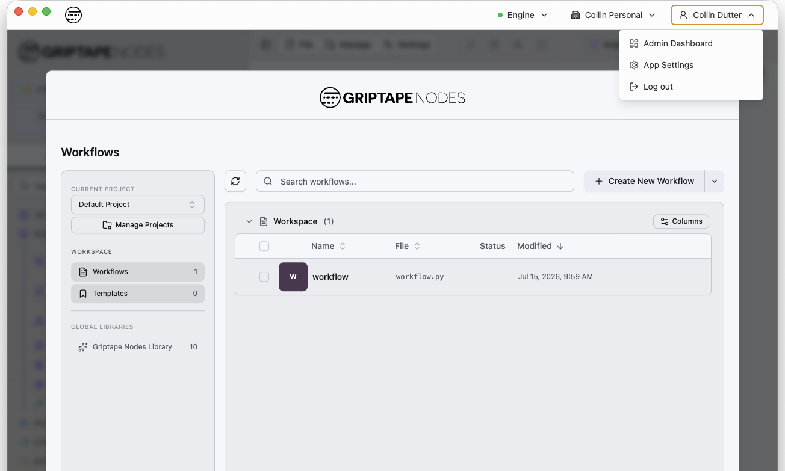
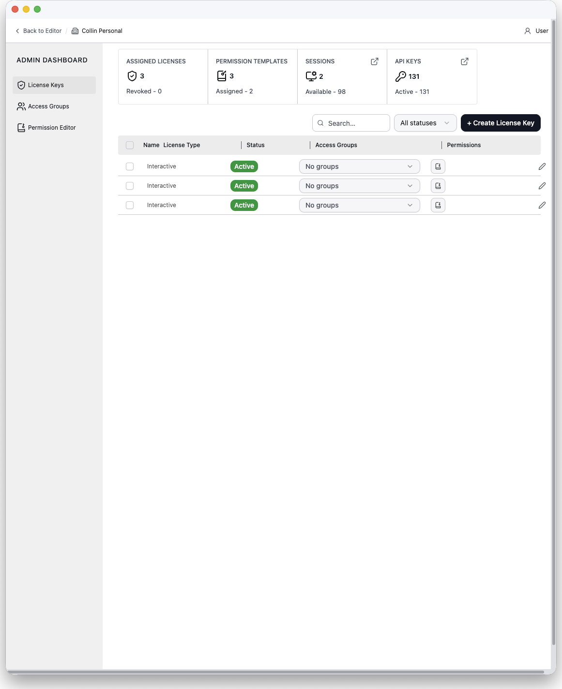
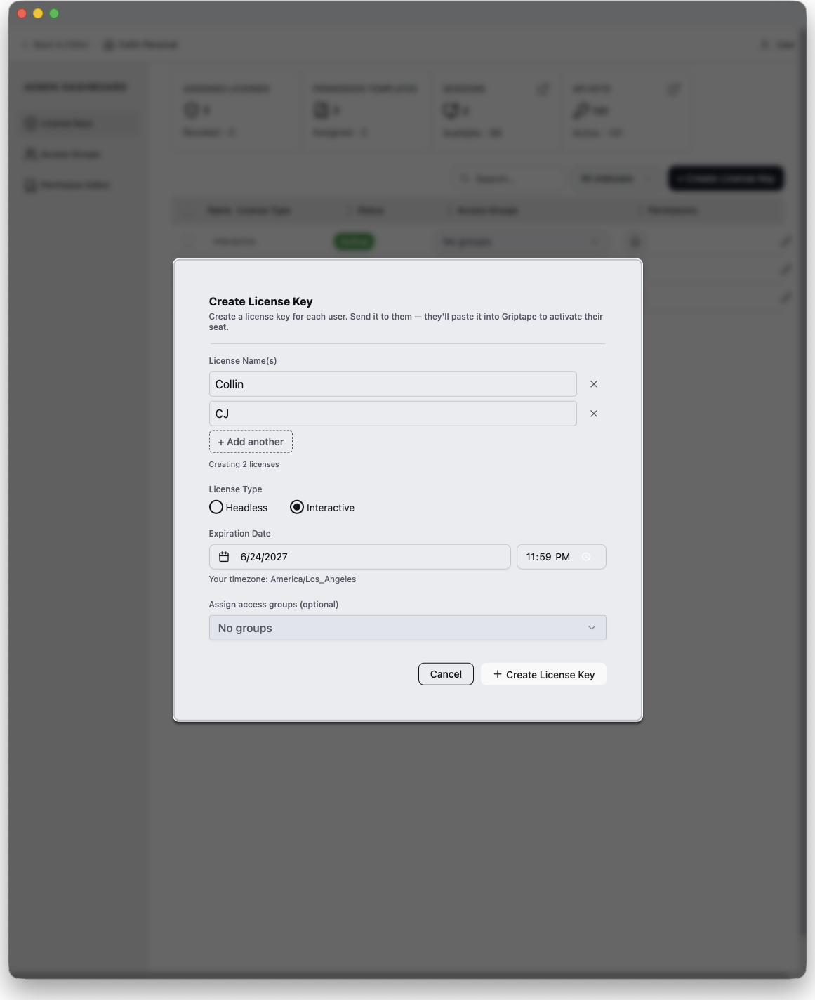
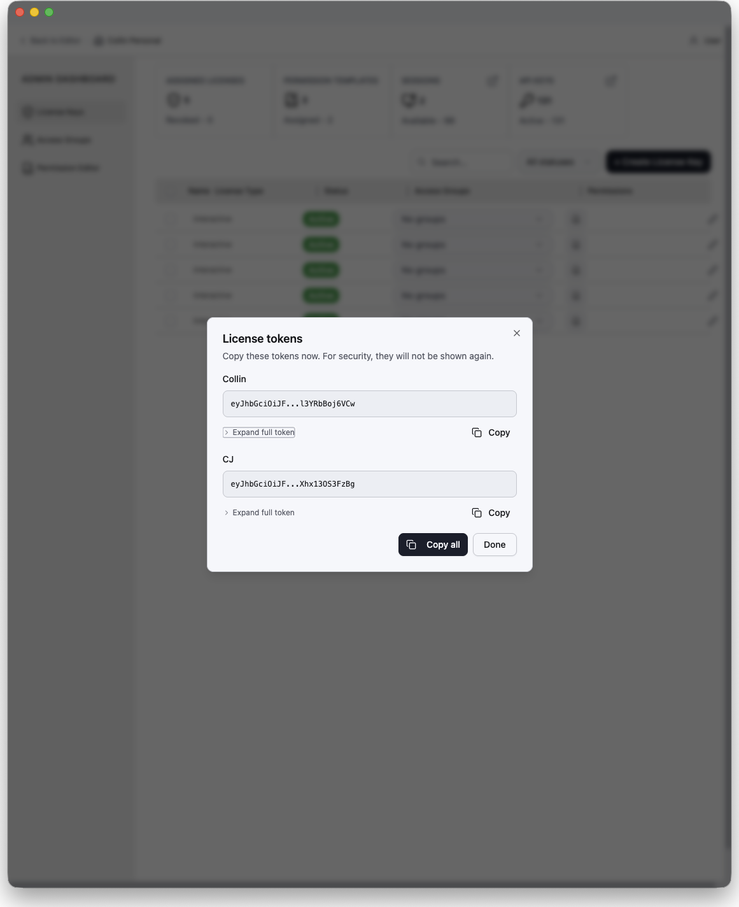
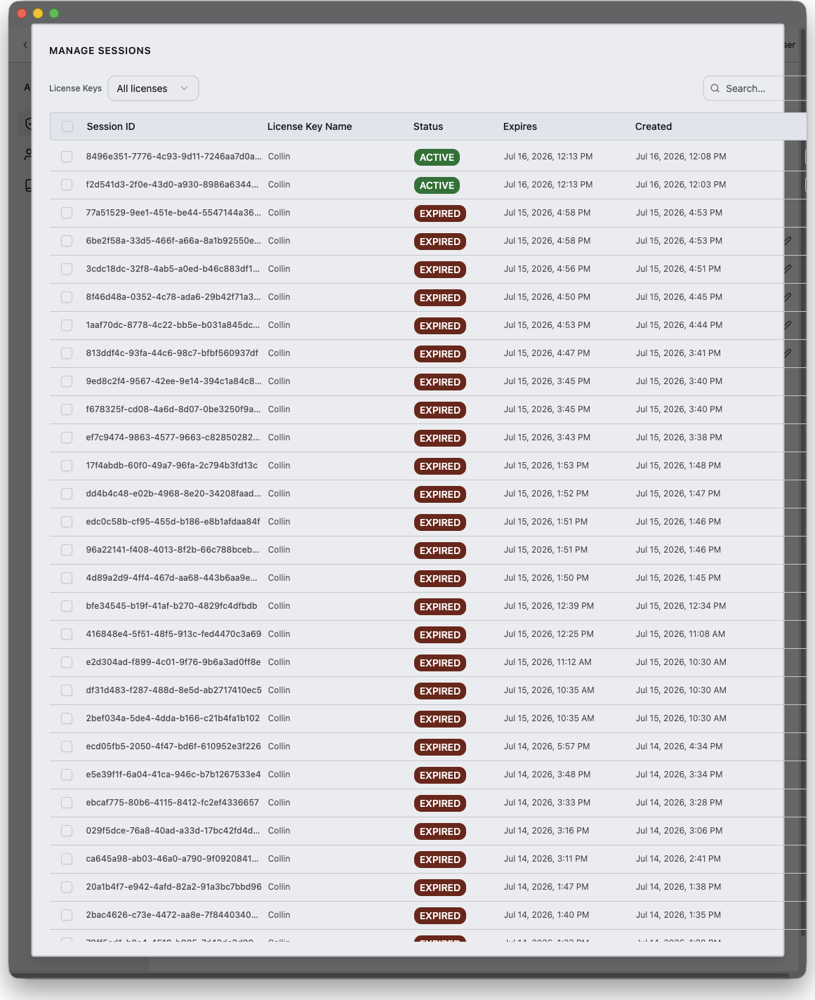
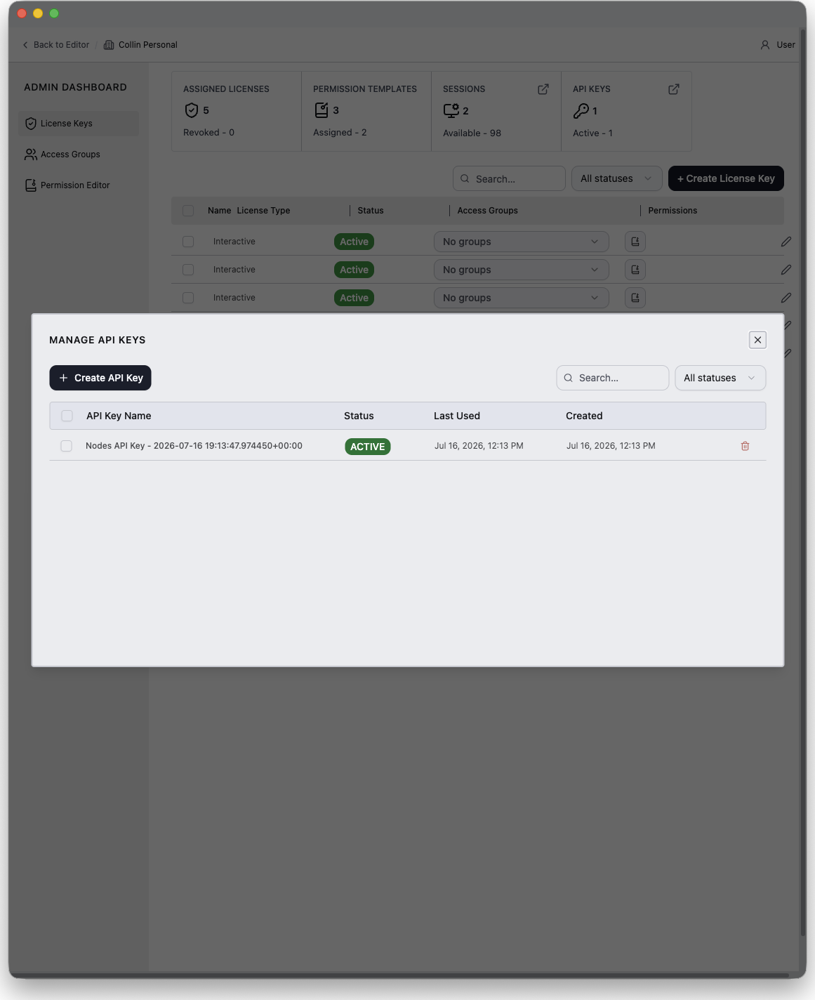
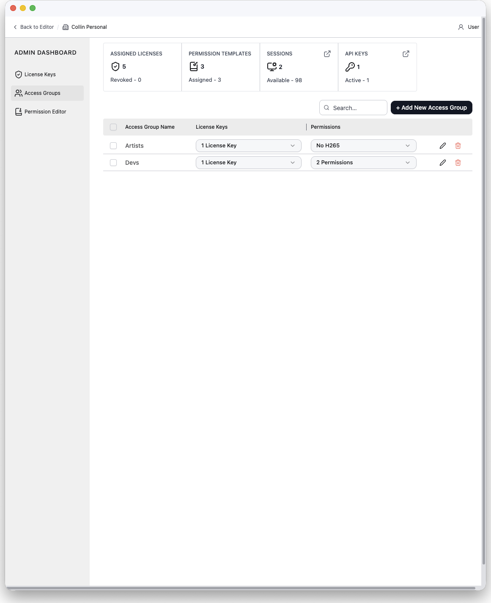
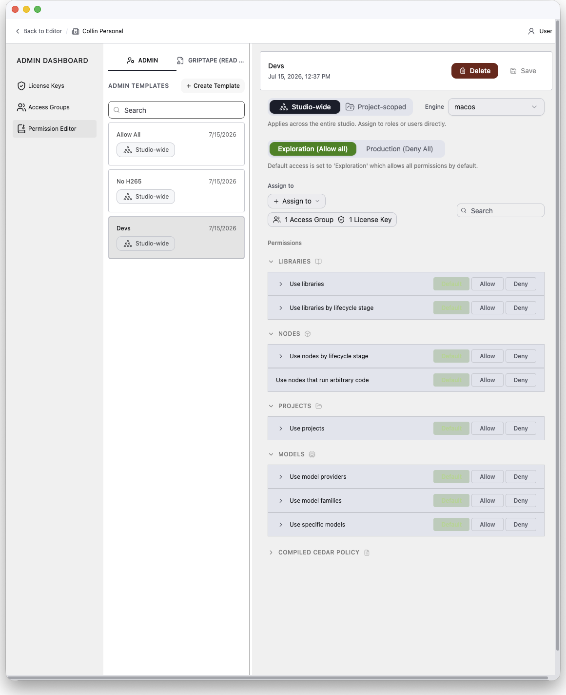
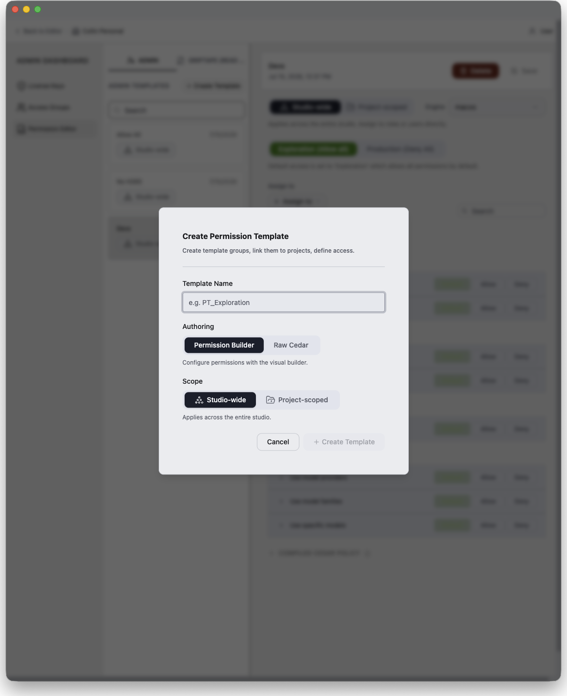
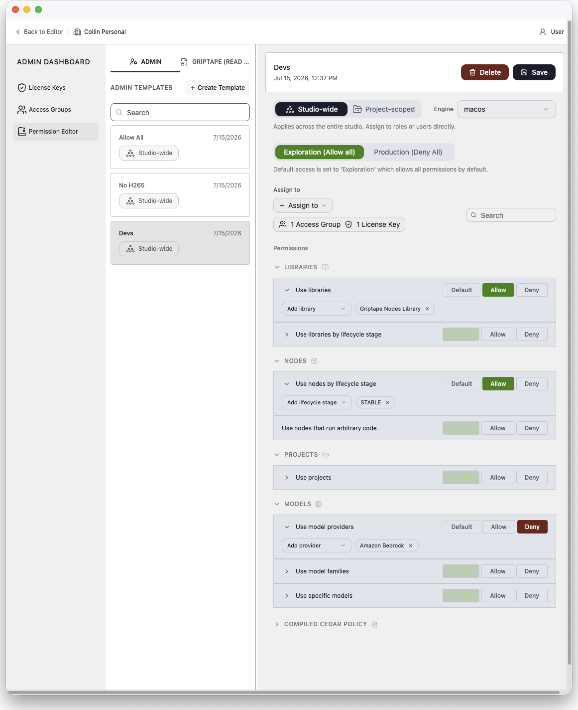

# Admin Dashboard

The Admin Dashboard is the administration interface built into the Griptape Nodes editor. Organization owners use it to issue and manage license keys, organize users into access groups, and control exactly what each user can do with permission templates — which libraries and nodes they can load, which models they can call, and which projects they can open.

## Who can use it

The Admin Dashboard manages **organizations you own**, and it talks to Griptape Cloud — so it is only available when you are **signed in with a Griptape Cloud account**.

In the desktop application this means the dashboard appears only for users who signed in through **Login or Sign-Up**, not for seats activated with a license key. License activation (see [Using the Admin Server](using_the_admin_server.md)) creates a session with no cloud account behind it: those users are the seats being managed, and the **Admin Dashboard** menu entry never appears for them. The entry is also hidden when your active organization is one you do not own.

If you own more than one organization, an organization switcher in the dashboard's top bar lets you move between them; you can never switch into an organization you do not own.

## Opening the Admin Dashboard

In the desktop application, open the profile menu in the top-right corner (the button showing your name) and choose **Admin Dashboard**.

The dashboard opens in its own window, separate from the editor, so you can administer licenses side by side with your work. Choosing **Admin Dashboard** again focuses the existing window. Close the window when you are done — the editor is unaffected.

!!! note "Also available in the web editor"

    The same dashboard is available in the Griptape Nodes web editor: open the user menu in the bottom-left corner and choose **Admin Dashboard**. There it replaces the editor view, and the **Back to Editor** link in the top bar returns you to your workflow.

The dashboard has:

- A **top bar** with a **Back to Editor** link, the active organization (or an organization switcher), and the signed-in user.
- A **sidebar** with the three sections: **License Keys**, **Access Groups**, and **Permission Editor**.
- A **Dashboard Settings** menu pinned to the bottom of the sidebar, with links to the onboarding guide and this documentation.

### The welcome dialog

On your first visit, a welcome dialog summarizes your organization at a glance — assigned licenses, permission templates, and active sessions — and offers three "Get Started" shortcuts that map to the three sidebar sections:

1. **Create a license key for each user.** Generate a unique key per seat and send it to the user; they paste it into Griptape to activate their access.
1. **Create sets of license keys as access groups.** Group keys by department or project, then assign permission templates to the whole group.
1. **Customise permissions per project.** Build permission templates that control access studio-wide or per project.

Check **Don't show this again** to dismiss it permanently; you can bring it back at any time via **Dashboard Settings → Onboarding Guide**.

## License Keys

The **License Keys** section is the home page of the dashboard. It is where you issue seats: one license key per user, delivered to them as a token they paste into the desktop application (see [Using the Admin Server](using_the_admin_server.md) for the user-side activation flow).

### The stats bar

Four tiles across the top summarize the organization:

| Tile                     | Shows                                          | Click action              |
| ------------------------ | ---------------------------------------------- | ------------------------- |
| **Assigned Licenses**    | Total license keys, plus how many are revoked. | —                         |
| **Permission Templates** | Total templates, plus how many are assigned.   | —                         |
| **Sessions**             | Active sessions, plus how many are available.  | Opens the Sessions modal. |
| **API Keys**             | Total API keys, plus how many are active.      | Opens the API Keys modal. |

### The license table

Each row is one license key with:

- **Name** — usually the user or seat it belongs to.
- **License Type** — `Interactive` (a person using the editor) or `Headless` (automated/unattended use).
- **Status** — `Active`, `Revoked`, or `Expired`.
- **Access Groups** — an inline multi-select for the groups this key belongs to. With multiple rows selected, changing the value applies to every selected row.
- **Permissions** — a popover listing every permission template that applies to the key, both directly assigned and inherited through access groups (inherited entries show the source group). Templates can be removed from here.
- **Actions** — Edit, Reissue token, Revoke, and Delete.

The toolbar above the table provides search, a status filter, and the **+ Create License Key** button. Column headers sort; columns are resizable.

### Creating license keys

Click **+ Create License Key**. The dialog accepts:

- **License Name(s)** — one or more names. Adding several names creates a batch of keys in one step, one per name.
- **License Type** — `Interactive` or `Headless`. This **cannot be changed** after creation.
- **Expiration Date** — required; must be between 1 and 730 days from now.
- **Access Groups** — optionally add the new key(s) to existing groups.

When creation succeeds, a dialog reveals each license token **exactly once**. Copy the token(s) and deliver them to the users — the token cannot be retrieved again later. If you lose a token, use **Reissue** on the license to generate a new one.

### Managing license keys

- **Edit** — rename the key and change its access group membership.
- **Reissue token** — generates a fresh token for the same license (for example, when the original was lost). The new token is shown once, like at creation.
- **Revoke** — releases the key's existing sessions and prevents the token from allocating new sessions. Only active keys can be revoked or reissued.
- **Delete** — permanently removes the key. This cannot be undone.

### Sessions

Click the **Sessions** tile to open the Sessions modal. It lists your organization's sessions with the session ID, the license key that holds it, status, expiry, and creation time, filterable by status. From here you can:

- **Release** a session, with a configurable grace period, freeing the seat for another user.
- **Delete** a session record.

### API Keys

Click the **API Keys** tile to open the API Keys modal, which manages your organization's Griptape Cloud API keys (used, for example, to operate an [Admin Server](admin_server.md)). You can create a key — its value is revealed once, so copy it immediately — and delete keys that are no longer needed.

## Access Groups

Access groups collect license keys into sets — typically a department, a team, or a show — so permissions can be managed for the whole set at once. A permission template assigned to a group applies to every license key in it.

Each row is one group with:

- **Access Group Name**
- **License Keys** — an inline multi-select of the keys in the group.
- **Permissions** — an inline multi-select of the permission templates assigned to the group, covering both your own templates and Griptape-managed ones (marked with a Managed badge).

Create a group with **+ Add New Access Group**, giving it a name and optionally its initial license keys and permission templates. Groups can be edited or deleted from their row; deleting a group does not delete its license keys.

## Permission Editor

The Permission Editor is where you author **permission templates**: named policies that decide what a license key is allowed to do. Templates are assigned to access groups or directly to individual license keys; a key's effective permissions are the combination of everything assigned to it, and an explicit deny always wins over an allow.

### Template list

The left panel lists templates in two tabs:

- **Admin** — templates authored by your organization's admins. Fully editable.
- **Griptape (read-only)** — templates authored and maintained by Griptape. You can attach them to access groups or license keys and audit their contents, but not modify them.

Search filters both tabs. **+ Create Template** opens the creation dialog.

### Creating a template

The creation dialog asks for:

- **Template Name**
- **Authoring mode**:
    - **Permission Builder** — configure permissions with the visual builder described below. This is the recommended mode.
    - **Raw Cedar** — write the policy by hand in a [Cedar](https://www.cedarpolicy.com/) editor after creation. The builder is not available for raw Cedar templates.
- **Scope** (builder mode only) — **Studio-wide** or **Project-scoped** (see below).

### The permission builder

Selecting a builder template opens its detail panel, which is organized top to bottom:

#### Scope

A template is either:

- **Studio-wide** — applies across the entire studio, everywhere the license is used.
- **Project-scoped** — linked to a specific project template on an engine; it overrides the studio defaults only within that project.

The scope row also selects an **Engine**. Connecting an engine loads its manifest — the engine's installed libraries, project templates, models, and model providers — which populates the pickers throughout the builder, so you choose real resources by name instead of typing identifiers. Project-scoped templates additionally pick the **Linked project** from the engine's project templates.

#### Default access

The template's base posture, which decides what happens to anything you do not explicitly configure:

- **Exploration (Allow all)** — everything is allowed by default; you deny specific things. Suited to look-development and R&D.
- **Production (Deny All)** — everything is denied by default; you allow specific things. A lockdown posture for shows in production.

Explicit per-permission choices keep their meaning if you later switch the posture.

#### Assign to

Attach the template to **access groups** and/or directly to individual **license keys**. Assignments through a group reach every key in the group.

#### Permissions

The permission list is a catalog of capabilities grouped by category. Each row can be set to **Allow** or **Deny**, or left on **Default** to follow the posture, and most rows can be **scoped to specific resources** (for example, deny only certain libraries rather than all of them):

| Category      | Capability                        | What it controls                                                                                                                 | Scopeable to       |
| ------------- | --------------------------------- | -------------------------------------------------------------------------------------------------------------------------------- | ------------------ |
| **Libraries** | Use libraries                     | Loading node libraries.                                                                                                          | Specific libraries |
| **Libraries** | Use libraries by lifecycle stage  | Loading libraries at specific lifecycle stages (`STABLE`, `BETA`, `ALPHA`, `LABS`, `DEPRECATED`).                                | Lifecycle stages   |
| **Nodes**     | Use nodes by lifecycle stage      | Loading and instantiating nodes at specific lifecycle stages.                                                                    | Lifecycle stages   |
| **Nodes**     | Use nodes that run arbitrary code | Nodes that execute arbitrary Python or Cypher.                                                                                   | —                  |
| **Projects**  | Use projects                      | Loading and activating projects.                                                                                                 | Specific projects  |
| **Models**    | Use model providers               | Every model under a provider. Denied models are filtered out of model pickers and blocked from invocation; nodes stay creatable. | Specific providers |
| **Models**    | Use model families                | Models in specific families (e.g. Claude 4, GPT-4). Same picker filtering and invocation blocking as providers.                  | Specific families  |
| **Models**    | Use specific models               | Individual models by id. Same picker filtering and invocation blocking.                                                          | Specific models    |

When a template's settings collide with another template or access group that applies to the same license keys — for example, this template allows a capability that an assigned group's template denies — the affected rows are flagged with a conflict warning naming the conflicting templates and keys. Remember: a deny always wins.

#### Compiled Cedar

Under the hood the builder compiles your choices into [Cedar](https://www.cedarpolicy.com/) policy statements, which are what the engine actually enforces. The **Compiled Cedar Policy** section (collapsed by default) shows the Cedar from the last save, for auditing.

### Raw Cedar templates

Templates created in **Raw Cedar** mode skip the builder and expose a Cedar editor with syntax validation — a template with syntax errors cannot be saved. A read-only statement summary above the editor breaks the policy down per statement, and the same **Assign to** controls apply. New raw templates start with `permit(principal, action, resource);` (allow everything), mirroring the builder's exploration default.

### Griptape-managed templates

Selecting a template on the **Griptape (read-only)** tab shows a read-only detail view: its description, a per-statement breakdown of the permissions it grants, and its full Cedar source. Managed templates cannot be edited or deleted — the only actions are attaching them to (or detaching them from) access groups and license keys.

## How it fits together

A typical rollout looks like:

1. **Create permission templates** in the Permission Editor — for example, an "Exploration" template for R&D and a locked-down "Production" template that only allows approved libraries and model providers.
1. **Create access groups** for each team or show, and assign each group the appropriate templates.
1. **Create a license key per user**, adding each key to the right access groups, and send each user their token.
1. Users **activate** their seats by pasting the token into the desktop application (through your [Admin Server](admin_server.md) for on-premises deployments). License-activated users get the editor only — the Admin Dashboard never appears for them.
1. Monitor and manage seats from the License Keys section — watch active **sessions**, **release** stuck ones, **reissue** lost tokens, and **revoke** keys when someone leaves.
