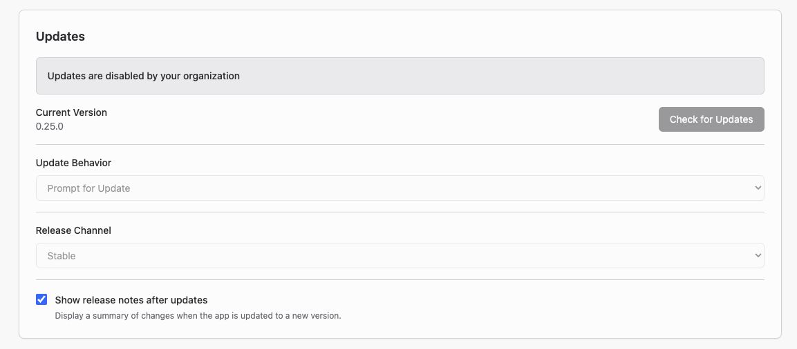

# Disabling App Updates

Administrators can disable Griptape Nodes Desktop updates with a machine-level
`policy.json` file. Use this when your organization distributes approved app
versions instead of letting each installation update itself.

This feature requires Griptape Nodes Desktop 0.24.0 or later. Earlier versions
ignore the file.

## Create the policy file

Create `policy.json` with this content:

```json
{ "disableUpdates": true }
```

Put it at the path for the machine's operating system:

| Platform | Path                                                                 |
| -------- | -------------------------------------------------------------------- |
| macOS    | `/Library/Application Support/ai.griptape.nodes.desktop/policy.json` |
| Windows  | `%ProgramData%\GriptapeNodes\policy.json`                            |
| Linux    | `/etc/griptape-nodes-desktop/policy.json`                            |

The app does not create the directory or the file. Create both manually or
through an imaging or device-management system before the user first launches
the app. If the app is already running, quit it first.

The app reads the policy once at launch. Changes to the file take effect the
next time the app starts.

## What users see



App Settings shows **Updates are disabled by your organization**. The following
controls are disabled:

- **Check for Updates**
- **Update Behavior**
- **Release Channel**

**Show release notes after updates** remains available, and shows the notes
after an administrator installs a new version.

If a user chooses **Check for Updates…** from the app menu on macOS or the
**Help** menu on Windows and Linux, the app shows **Updates are managed by your
organization**.

While the policy is enabled, the app does not run automatic or user-initiated
update checks. It sends no requests to the update feed.

## Install app updates

With the built-in updater disabled, distribute each approved installer to the
managed machines. The policy file is outside the app installation, so
installing a new version over the existing one does not remove it. Updates
remain disabled after installation.

Users can still install and update node libraries and models from inside the
app. Each app version continues to use the engine bundled with that version.

## Re-enable app updates

Delete `policy.json` or change `disableUpdates` to `false`, then restart the
app. The Updates section uses the machine's previous **Update Behavior** and
**Release Channel** settings.

Only a literal `true` disables updates. A missing file, invalid JSON, or any
other value leaves updates under user control. An unmanaged machine does not
need a policy file.

## Related

- [App Settings: Updates](../guides/desktop/app_settings.md#updates): update
    behavior and release channels
- [Admin Server](admin_server.md): keep managed machines off the public internet
