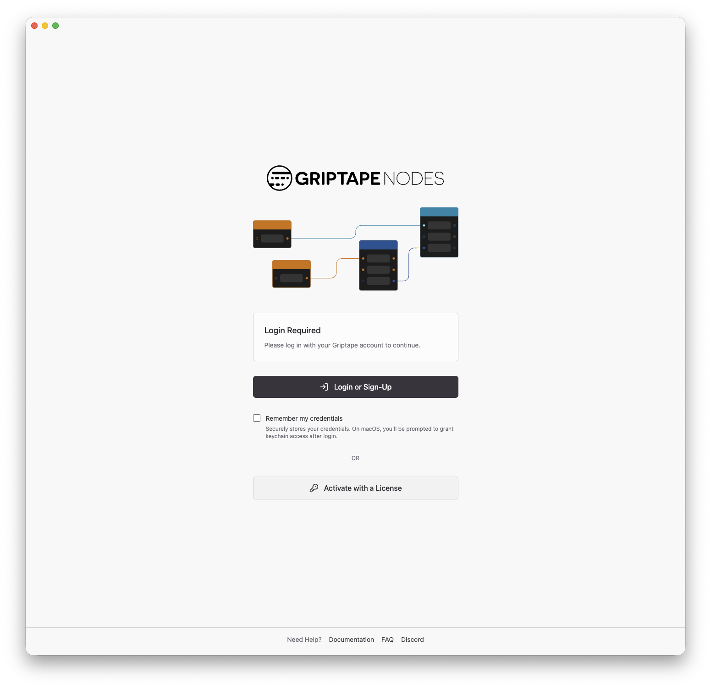
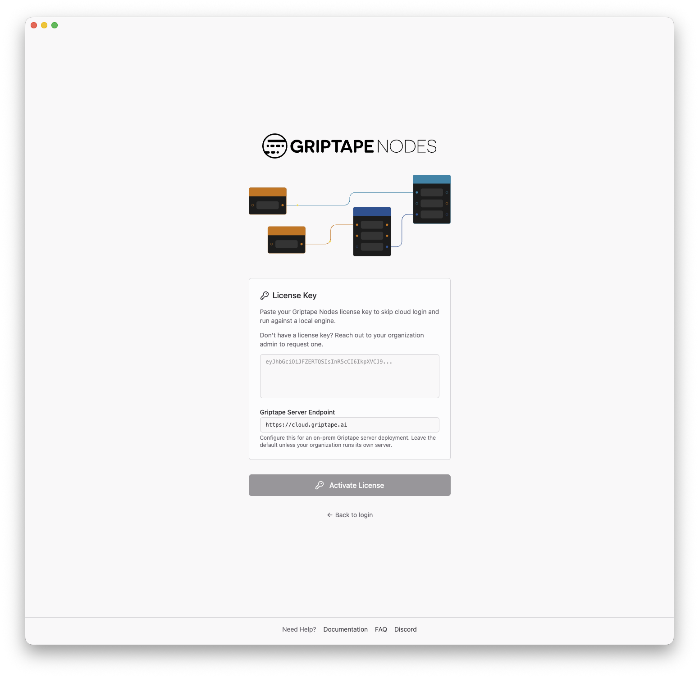
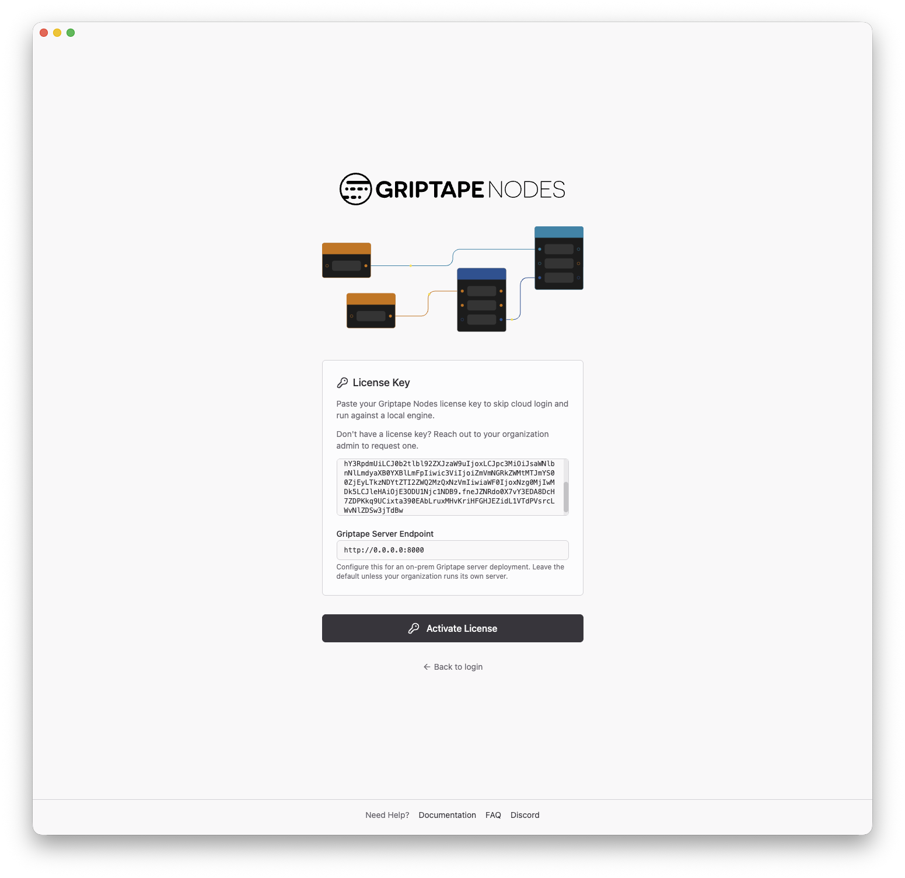

# Using the Admin Server

Once your [Admin Server](admin_server.md) is up and running, users connect to it from the Griptape Nodes desktop application by activating with a license instead of logging in through Griptape Cloud. This page walks through that flow from the user's perspective.

## Before you start

Each user needs:

- **The Griptape Nodes desktop application** installed.
- **A license key.** These are issued to your organization; users should request one from their organization admin.
- **The Admin Server address.** The URL where your Admin Server is reachable on your network, for example `http://admin.internal.example.com:8080`. Your Admin Server operator can provide this.

## Activate with a license

### 1. Open the license form

Launch the desktop application. On the login screen, instead of signing in with Griptape Cloud, click **Activate with a License**.



### 2. Paste your license key

In the **License Key** field, paste the license key you received from your organization admin.



### 3. Point at the Admin Server

In the **Griptape Server Endpoint** field, replace the default Griptape Cloud address (`https://cloud.griptape.ai`) with your Admin Server's address:

```text
http://admin.internal.example.com:8080
```

This is the key step for an on-premises deployment: with the endpoint set, the application sends all of its Griptape Cloud traffic through the Admin Server instead of reaching the public internet directly.



### 4. Activate

Click **Activate License**. The application validates the license and launches the engine as normal, taking you to the editor. From this point on, everything — licensing, sessions, and any Cloud features your organization has permitted — flows through the Admin Server.

## Reusing a saved license

Licenses you have activated before are remembered. If you log out (or the license is deactivated), the login screen shows a **Saved licenses** section after you click **Activate with a License**. Click **Use** next to a saved license to re-activate it without pasting the key again. The configured server endpoint is also remembered, so you only need to enter the Admin Server address once.

## Troubleshooting

- **Activation fails immediately.** Check that the license key was pasted completely and has not expired. If the key looks right, confirm the **Griptape Server Endpoint** is correct and that the machine can reach it — try opening `http://<admin-server-address>/health` in a browser; a healthy server responds with `{"status":"ok"}`.
- **Activation worked before but fails now.** The license may have expired. Ask your organization admin for a new one.
- **Some features return errors after activating.** If the Admin Server is configured with [forwarding rules](admin_server.md#forwarding), paths that are not permitted are rejected with `403 {"error":"path not permitted"}`. Ask your Admin Server operator whether the feature's routes are allowed to egress.
- **Everything returns errors.** If every request fails, the Admin Server itself may be unable to reach Griptape Cloud. This is an operator-side issue — see the [Admin Server troubleshooting section](admin_server.md#troubleshooting).
