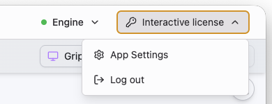
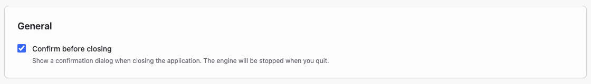
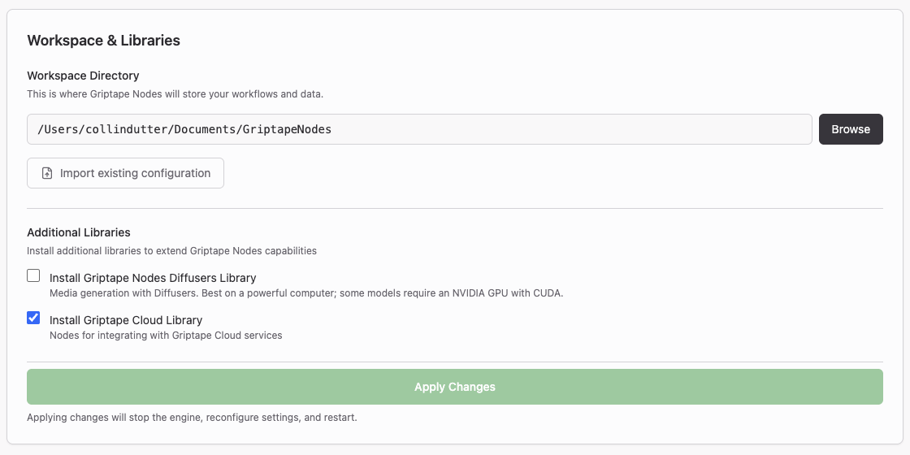
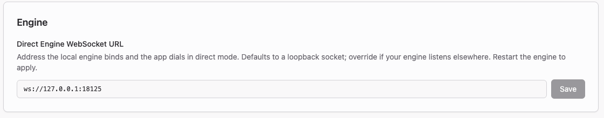

# App Settings

Griptape Nodes Desktop has its own settings screen, separate from the
engine and editor settings you reach from the editor's **Settings** menu.
App Settings covers what the application itself owns: how it closes, which
theme it wears, the workspace it hands to the engine, your license, log
files, and how the app updates itself.

## Opening App Settings

Click your name in the top-right corner of the window, then choose
**App Settings**. If you activated with a license key instead of signing
in with a Griptape account, the button reads **Interactive license** (or
whatever your license type is) rather than your name.

Click **Back to editor** in the top-left corner when you're done. Most
changes save as soon as you make them; the places where they don't are
called out below.

!!! note

    App Settings is not the same as the editor's **Settings** menu. That
    menu configures the engine and the editor — canvas theme, autosave,
    API keys and secrets, MCP servers, library settings — and is
    documented in the [editor overview](../editor/index.md#settings).
    Only Griptape Nodes Desktop has App Settings; if you run the engine
    yourself and use the editor in a browser, see
    [Configuration](../configuration.md) instead.

## General

**Confirm before closing** shows a confirmation dialog when you quit.
Quitting stops the engine, which cancels anything still running, so
leaving this on is a good idea if you run long workflows.

## Appearance

**Theme** sets the application chrome to **Light**, **Dark**, or
**System** (follow your operating system's setting).

**Show system monitor** adds a strip below the main navigation with live
CPU, memory, and GPU utilization, updated every second. Useful when
you're running local models and want to see whether you're out of
headroom.

## Workspace & Libraries

**Workspace Directory** is where Griptape Nodes stores your
[project files](../../glossary.md#project-files) and
[generated assets](../../glossary.md#generated-assets). Use **Browse** to
pick a different folder. Changing it doesn't move your existing files, so
point it at a folder you can find again. See
[Workspace](../projects/workspace.md) for how the engine uses it.

**Import existing configuration** opens the **Import Configuration**
dialog, which looks in the usual places for a Griptape Nodes
configuration from an engine you installed and set up yourself. Pick the
one you want under **Select configuration to import** and the app adopts
its settings, including its workspace directory, so you don't have to
re-enter them. If nothing turns up, use **Browse for config file** or
**Scan home directory**.

**Additional Libraries** installs optional node libraries alongside the
built-in ones:

- **Install Griptape Nodes Diffusers Library** — media generation with
    Diffusers. It wants a powerful machine, and some models need an NVIDIA
    GPU with CUDA.
- **Install Griptape Cloud Library** — nodes for Griptape Cloud services.

Both are also installable later from **Manage → Library Management**; see
[Libraries](../libraries.md).

Nothing in this section takes effect until you click **Apply Changes**,
which stops the engine, reconfigures it, and starts it again. Save your
workflow first.

## Engine

!!! note

    This section only appears if you activated with a license key, which
    puts the app in direct engine mode. If you signed in with a Griptape
    account, you won't see it — restarting and managing the engine lives
    on the Engine page instead.

**Direct Engine WebSocket URL** is the address the local engine binds to
and the app dials when it talks to the engine directly. The default,
`ws://127.0.0.1:18125`, is a loopback socket that only your machine can
reach. Change it only if your engine listens somewhere else, then restart
the engine to apply it.

## License

If your organization runs Griptape Nodes on license keys, this section is
where you manage them. Each activated license shows as a card with its
organization, license ID, type, and expiry date, plus an **Active** badge
when it's the one in use. Use the pencil icon to give it a friendlier
name, or **Remove** to deactivate it on this machine. Making a different
license the active one restarts the engine.

**Griptape Server Endpoint** points the engine at an on-premises Griptape
server for cloud and license requests instead of the default
`https://cloud.griptape.ai`. Restart the engine after changing it.

To add another key, paste it into the box and click **Add & Activate**.

For the full activation walkthrough, see
[Using the Admin Server](../../enterprise/using_the_admin_server.md).
Administrators issuing the keys should start with the
[Admin Dashboard](../../enterprise/admin_dashboard.md).

## Logging and Diagnostics

Turn these on before reproducing a problem you want to report.

- **Write engine logs to file** — saves engine output to a log file.
    Files rotate at 10MB. With this on, you can also export engine logs
    from the Engine page.
- **Write application logs to file** — saves application and editor logs,
    also rotating at 10MB. **Export** asks whether you want the current
    session or a specific time range, then writes the logs out to a file
    you can attach to a bug report.
- **Log Retention** — how long to keep log files before deleting them
    automatically. Pick a number and a unit (**Days**, **Months**, or
    **Years**); the default is 7 days. Check **Don't delete log files** to
    keep them forever.

See [Troubleshooting](../../troubleshooting.md) for what to look for once
you have the logs.

## Updates

**Current Version** is the app version you're running, and **Check for
Updates** looks for a newer one right now instead of waiting for the next
launch.

**Update Behavior** controls what happens when an update is found:

| Setting               | What it does                                                                  |
| --------------------- | ----------------------------------------------------------------------------- |
| **Auto-Update**       | Downloads and installs updates automatically on startup.                      |
| **Prompt for Update** | Shows a notification banner when an update is available. This is the default. |
| **Silence Updates**   | Doesn't check for or notify you about updates.                                |

**Show release notes after updates** displays a summary of what changed
after the app updates itself.

### Release channels

**Release Channel** picks which builds the app updates to.

| Channel     | What you get                                                                                                                                           |
| ----------- | ------------------------------------------------------------------------------------------------------------------------------------------------------ |
| **Stable**  | Tested releases. This is the default and what you want unless you have a reason to be on Nightly.                                                      |
| **Nightly** | A fresh build published every day, bundling pre-release engine and editor builds along with the app. Versions look like `0.22.0-nightly.20260611.123`. |

Nightly builds go out once a day, and only the 14 most recent are kept, so
a nightly install left alone for longer than a couple of weeks will jump
several versions when it next updates.

!!! warning

    Nightly builds are cut from the latest development work rather than a
    tested release. They can contain bugs, half-finished features, and
    changes that get reverted. Don't use Nightly for production work, and
    save your workflows often if you do run it.

Switching channels takes effect at the next update check, whether that's
the next time you launch the app, the check that runs every few hours in
the background, or the moment you click **Check for Updates**. You don't
need to reinstall, and switching back to **Stable** works even though the
stable version number is lower than the nightly you were on. Your
workspace, workflows, and settings are untouched either way.

If you install the engine yourself instead of using the app, the
equivalent is the pre-release engine channel described in the
[FAQ](../../faq.md#how-can-i-test-out-unreleased-features).

## Griptape Cloud API Key

The API key the app provisioned for you, hidden by default. **Show**
reveals it and **Copy** puts it on your clipboard — handy when you want to
use the same key with a manually installed engine or a script. Treat it
like a password. This section only appears if the app has a key for you,
so you won't see it if you activated with a license key instead of signing
in.

## App Data Locations

The directories where the app keeps its own data, separate from your
workspace. **Open** reveals a folder in Finder, Explorer, or your file
manager. Log files are not in here; export those from
[Logging and Diagnostics](#logging-and-diagnostics) or, for engine logs,
the Engine page.

## Environment Information

A snapshot of exactly what you're running: app version and build, the
bundled editor version, the Python interpreter and its installed packages,
the Griptape Nodes engine version and bundle directory, and your platform
details. **Refresh** re-reads it.

**Copy** puts the whole report on your clipboard and **Export...** saves
it to a file. Attach one of those to any bug report you file.
