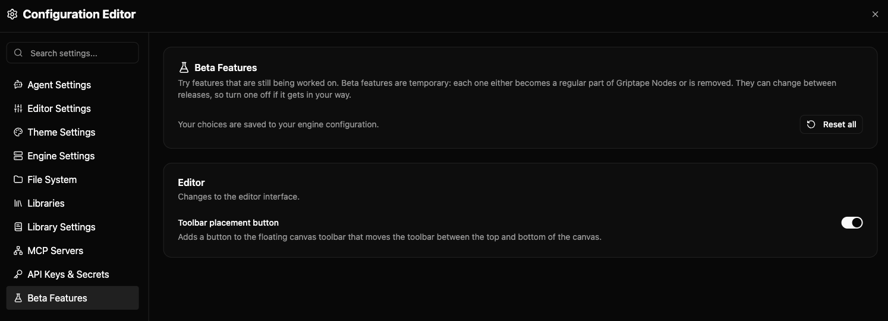

# Beta Features

Beta features are new features that aren't ready to be on for everyone yet.
You can turn them on to try them early, and turn them off again at any time.
They're managed from the **Beta Features** page in the editor's settings.



## Turning a beta feature on or off

Open the **Settings** menu in the editor's header, choose **All Settings**,
and click **Beta Features** at the bottom of the list on the left. Each feature is listed with a short
description of what it changes and where, and a toggle to turn it on or
off. Your choice is saved with the rest of your settings, so it stays
the same the next time you open the editor.

Features are grouped by where they come from:

- **Editor** features change how the editor looks or behaves.
- **Engine** features change what happens behind the scenes, such as
    how workflows run. They come from the engine you're connected to, so
    the list can differ between engines and engine versions.

Node libraries can offer beta features too. These are listed in the
**Engine** group, next to the engine's own features. They usually add or
change something on that library's nodes, and their description says
which. They appear when the library is loaded and disappear when it's
removed.

To go back to the standard behavior for everything, click **Reset all**.
Every feature returns to its default, which is almost always off.

### Nodes already on the canvas

A library feature that adds or hides settings on a node shows the change
on nodes you add after turning it on or off. Nodes already on the canvas
keep the settings they were created with. To update one, refresh the node, delete it and add it again, or save and reopen the workflow.

### When a toggle can't be changed

A toggle is greyed out when something outside your own settings is
choosing that feature's value. This happens when a project, a workspace,
or an environment variable sets it. A note under the toggle says which
one. Change the value there, or remove it, to control the feature from
this page again.

## What to expect from a beta feature

- **Beta features can change or disappear.** Each one is either made a
    standard part of Griptape Nodes or removed within a few months. When
    that happens, it drops off this page, and your saved choice for it
    has no effect.
- **Your workflows are safe either way.** A beta feature never changes
    what gets saved in a workflow. A workflow opens the same way whether a
    feature is on or off, so you can share workflows with people who have
    different features turned on.
- **Rough edges are expected.** If something behaves unexpectedly, turn
    the feature off to get the standard behavior back.

## Setting beta features without the editor

Your choices are saved in the `beta_features` section of your
`griptape_nodes_config.json` file, keyed by each feature's id:

```json
{
    "beta_features": {
        "canvas_toolbar_placement_button": true
    }
}
```

Library features are saved in `library_beta_features`, under the
library's name in lowercase with spaces and punctuation turned into
underscores. For a library called "Acme Image Tools":

```json
{
    "library_beta_features": {
        "acme_image_tools": {
            "sharpen_after_upscale": true
        }
    }
}
```

Only `true` or `false` counts. Any other value, such as `"yes"`, is
ignored with a warning in the engine log, and the feature uses its
default. A mistake here never affects your other settings.

You can also turn a feature on for a single session with an
environment variable. Put the feature's id, in capitals, after
`GTN_CONFIG_BETA_FEATURES__`:

```bash
GTN_CONFIG_BETA_FEATURES__PARALLEL_BRANCH_RESOLUTION=true gtn
```

For a library feature, use `GTN_CONFIG_LIBRARY_BETA_FEATURES__`, then the
library's key in capitals, two underscores, and the feature's id:

```bash
GTN_CONFIG_LIBRARY_BETA_FEATURES__ACME_IMAGE_TOOLS__SHARPEN_AFTER_UPSCALE=true gtn
```

The feature and library names used above are examples. To add beta
features to a library you're building, see
[Authoring Libraries](../../development/custom_nodes/authoring_libraries.md#beta-features).
See [Engine Configuration](../configuration.md) for how config files
and environment variables are loaded.
