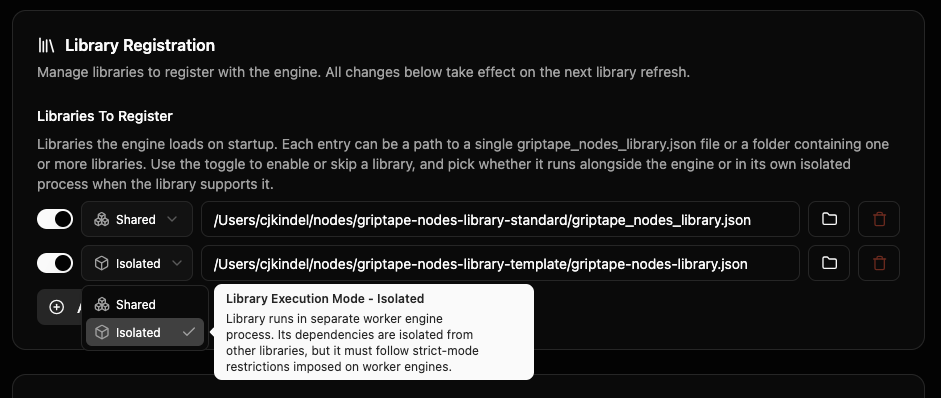

# Libraries

A **library** is a bundle of nodes you can use in the editor. Some
ship with the engine, some you install from a Git URL, some you write
yourself. This page is for the artist installing and using libraries
— not the developer authoring them. (Library authors: see the
[Custom Nodes guide](../development/custom_nodes/index.md) and
[Node Isolation with Workers](../development/custom_nodes/node_isolation_with_workers.md).)

If you're worried about installing two libraries that conflict, jump
to [Coexistence guarantees](#coexistence-guarantees) — the short
answer is that two libraries' Python dependencies cannot break each
other, but two libraries with the same node name can be ambiguous
and the engine will tell you about it.

## What you start with

The engine supports a **Sandbox Library** — a scratchpad library
for quickly developing your own custom nodes without authoring a
full library. It isn't there until you set one up: under
**Settings → Library → Sandbox Settings**, point **Sandbox Library
Directory** at a folder that exists on disk. Once it does, the
engine picks up `.py` node files from that directory, and what you
see in the editor's Sandbox category depends on what's actually in
it.

During `gtn init`, you're offered the **Advanced Media Library**
(diffusion, image generation, video). You can register it then or
re-run `gtn init` later to add it. See the
[FAQ](../faq.md#how-do-i-install-the-advanced-media-library-after-initial-setup)
for that path.

Other libraries — first-party or community — you install yourself
through the editor.

## Installing a library (in the editor)

The editor's **Libraries** panel is the primary install surface.
Open it from the header's **Manage** menu → **Library
Management**.

Click **Add Library** (top right) to open the **Add Library**
modal. Paste a Git URL (for example a GitHub repository hosting a
community library) and click **Install**. The editor clones the
repo, reads the library's `griptape_nodes_library.json` manifest,
installs its dependencies, and registers it. **Advanced Options**
in the modal lets you pick a specific branch, tag, or commit
instead of the repository default.

Not sure what to install? The **Browse Community Libraries** button
at the bottom of the modal opens a curated list of libraries you
can install.

After a successful install, the new library appears in the panel's
library list. Each entry shows:

- The library's name and version.
- The number of nodes it provides.
- An **Open** action that opens the library's directory in your
    file manager.
- An **Advanced** disclosure that shows the library's Git remote,
    ref (branch or tag), and current commit. If you ever need to
    report a bug, the commit shown there is the precise version to
    cite.

You can filter the list by **All**, **Updates**, or **Errors**
using the chips above it. **Errors** is your first stop when
something is wrong with one of your libraries — it surfaces install
failures, dependency-install failures, and load-time failures
together.

## Updating libraries

In the same **Libraries** panel, the icon buttons next to the
filter chips let you:

- **Check for updates** — scan all installed libraries for new
    versions. Anything with an update available shows up under the
    **Updates** filter.
- **Refresh** — re-read the library list (helpful if you just
    installed something and want to confirm it took).

For ambient update awareness, **Configuration Editor → Libraries**
controls how aggressively the engine checks for library updates on
its own.

**Update Notifications** options:

- **Enable sidebar notifications** — show a badge on the Libraries
    tab and per-library buttons when an update is available.
- **Notification color / animation** — visual style for the badge.
- **Check on startup** — scan for updates each time the engine
    loads.
- **Check periodically** — repeating schedule (Never, Hourly, etc.).
- **Check Now** — trigger an immediate scan.

You don't have to configure any of this; the defaults are fine for
most artists.

## Toggling and removing libraries

The same **Configuration Editor → Libraries** view also shows
**Library Registration → Libraries To Register**. Each entry in
that list is a library the engine loads at startup. Three controls
per entry:

- The toggle (left) — flip off to keep the library on disk but stop
    loading it on engine start.
- The **Shared / Isolated** dropdown (middle) — choose where the
    library runs (see below).
- The trash icon (right) — remove the entry entirely. The clone on
    disk stays put; delete its directory manually if you want the
    disk space back.

### Shared vs. Isolated

The dropdown picks the process a library runs in:

- **Shared** — the library runs inside the main engine process,
    alongside the other shared libraries.
- **Isolated** — the library runs in its own separate process, so
    its Python dependencies are walled off from every other library
    and a crash in it can't take the rest of the engine down.

The dropdown shows the mode the engine will actually use: the
library author's suggested mode, unless you override it here. Pick
**Isolated** for a heavy library you want walled off, or **Shared**
to keep it in-process. Some libraries are marked by their author as
incompatible with isolation; for those the dropdown is **locked to
Shared**.

The dropdown only appears when your engine version supports it
(0.86.0 and later). Changes take effect on the next library
refresh.

The **Add Library** button below lets you point the engine at a
`griptape_nodes_library.json` you already have on disk (a library
you cloned manually, or a library you're developing locally).

## Coexistence guarantees

The point of installing two libraries side-by-side is that they
can't break each other. Three layers control how well that holds:

### Python dependency isolation

Every registered library gets its own **virtual environment** — an
isolated set of Python packages that doesn't share state with the
engine's own packages or with any other library's. Library A can
pin `torch==2.4.1`; library B can pin `torch==2.0.0`. Both are
installed into separate `.venv` directories, and each library uses
its own when its nodes run.

This holds whether a library runs **Shared** or **Isolated** (see
[Process isolation](#process-isolation-the-isolated-mode)): the
`.venv` lives on disk next to the library's manifest either way.
The difference is only which process loads those packages — the
main engine process for Shared libraries, the library's own process
for Isolated ones. From the artist's perspective the dependency
isolation is the same.

**You can install incompatibly-pinned libraries together without
pip resolution conflicts.** This is the most important guarantee on
this page.

### Process isolation: the Isolated mode

Running a library **Isolated** (in its own dedicated process,
instead of inside the engine's main process) gives you:

- **Fault tolerance.** If the library crashes, only that library
    goes down — the rest of the engine keeps running.
- **Resource isolation.** Anything the library loads into memory
    (model weights, GPU memory, background threads) lives in the
    library's own process and can't degrade other libraries.

Heavy ML libraries (diffusion, transformers, custom CUDA stacks)
benefit most; lightweight libraries (simple HTTP / data nodes)
usually run fine Shared. You control this per library with the
**Shared / Isolated** dropdown described in
[Toggling and removing libraries](#shared-vs-isolated). The library
author sets the suggested starting mode and whether the library is
allowed to run Isolated at all; your dropdown choice overrides the
author's suggestion for any library that permits it.

Library authors declare isolation compatibility and a suggested
mode in their `griptape_nodes_library.json` (the
`worker_mode_compatibility` and `suggested_worker_mode`
declarations) — see [Node Isolation with Workers](../development/custom_nodes/node_isolation_with_workers.md)
for the schema. As an artist, the Shared / Isolated dropdown is the
only surface you need.

### Node-name collisions: not solved

If two libraries register a node class with the same name (e.g.
both ship a `MyImageNode`), the engine accepts both. **The engine
does not warn you at install time.** When you create that node:

- If your workflow names the library explicitly, it works.
- If it doesn't, the engine raises an error listing both libraries
    so you can disambiguate.

This is the one coexistence concern the engine doesn't solve for
you. If you suspect a collision, the safest fix is to remove the
library you don't want from the **Libraries To Register** list.

## When something goes wrong

### "I installed the library but I don't see its nodes"

Open the **Libraries** panel and switch the filter to **Errors**.
That's the consolidated view of every library that failed to
install, failed to install dependencies, or failed to load. Click
into the offending library for the specific error message.

Common causes:

- The library pins a wheel (a pre-built Python package) that
    doesn't exist for your Python version or platform — for example a
    `torch` wheel for an unsupported CUDA version.
- Your network blocked the install (corporate proxy, or no internet
    during the install step).
- Disk full (the engine reports this explicitly).

Fix the underlying issue, then re-trigger the install (re-paste the
URL in the **Add Library** modal, or use the CLI alternative below
with `--overwrite`).

### "A node looks broken or red in the editor"

The engine couldn't construct that node — usually because its
library failed to load. The editor swaps in a placeholder so your
workflow file isn't corrupted. Check the **Errors** filter in the
**Libraries** panel for the underlying load error; once you fix it,
reopening the workflow uses the real node again.

### Looking for the raw error text

The terminal window where the engine is running (the same window
you launched the engine from) carries the verbose error log,
including stack traces. Errors from libraries running Isolated
appear there with a `Worker-<id>` prefix.

## CLI alternatives

If you'd rather use the command line — for automation, headless
engines, or just preference — the editor's library actions have
`gtn` equivalents:

| Editor action                       | CLI equivalent                     |
| ----------------------------------- | ---------------------------------- |
| Add Library → Install               | `gtn libraries download <git_url>` |
| Check for updates → install pending | `gtn libraries sync`               |
| Sync over local edits               | `gtn libraries sync --overwrite`   |
| Re-register Advanced Media Library  | `gtn init`, answer `y`             |

See [Command Line Interface](../reference/command_line_interface.md) for the
full reference.

## Where libraries are stored on disk

- **Config**: `~/.config/griptape_nodes/griptape_nodes_config.json`
    (or the platform equivalent — see
    [Engine Configuration](configuration.md)). The
    `app_events.on_app_initialization_complete.libraries_to_register`
    list inside it is what the editor's Libraries To Register list
    edits.
- **Clones / venvs**: in the directory the editor cloned the
    library into; the library's `.venv` lives next to its
    `griptape_nodes_library.json`.
- **Sandbox library**: the sandbox directory is configured
    separately in your settings; defaults vary by platform.

To pin a project to specific library versions (so activating it provisions
and, if needed, overwrites libraries to match), see
[Pinning engine and library versions](projects/version_pinning.md).

For library authors: see [Custom Nodes](../development/custom_nodes/index.md)
and [Node Isolation with Workers](../development/custom_nodes/node_isolation_with_workers.md).
