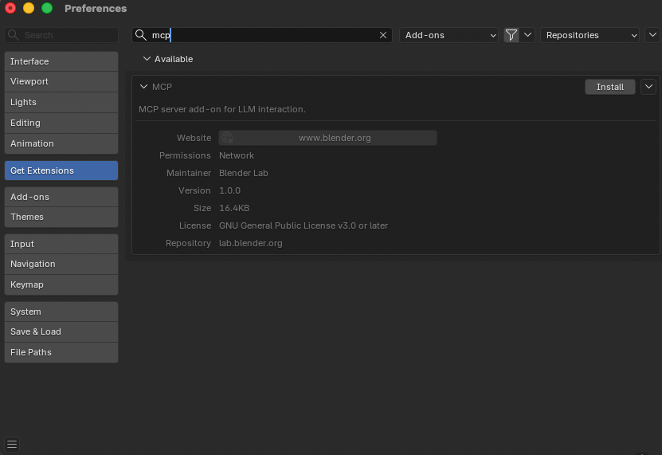
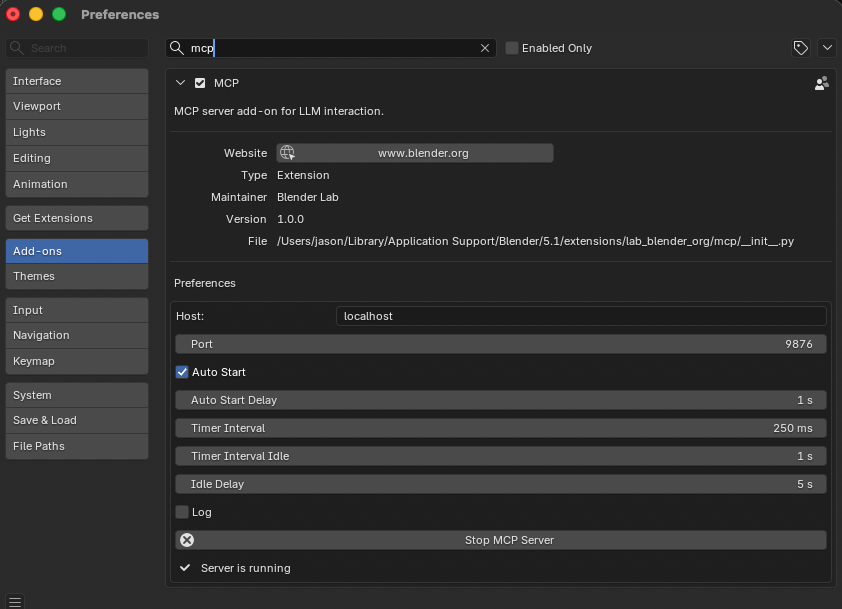

# Blender MCP Server

The **[Blender MCP Server](https://www.blender.org/lab/mcp-server/)** is the official MCP integration for [Blender](https://www.blender.org), developed and maintained by the Blender Lab team. It allows AI agents to directly interact with and control Blender for prompt-assisted 3D modeling, scene inspection, and manipulation.

!!! note "Prerequisites"

    Before using the Blender MCP server, you must:

    1. Have [Blender](https://www.blender.org) 5.1 or newer installed
    1. Install the `uv` package manager ([installation instructions](https://docs.astral.sh/uv/getting-started/installation/))
    1. Clone the [Blender MCP repository](https://projects.blender.org/lab/blender_mcp)
    1. Install the Blender MCP extension (see below)

## Installing the Blender MCP Extension

The Blender MCP server is distributed as a Blender Extension through the official Blender Extensions platform.

1. Visit [blender.org/lab/mcp-server](https://www.blender.org/lab/mcp-server/#addon) and scroll down to the **Add-on** section

1. Choose one of the two installation methods:

    **Option A — Drag and Drop**

    Drag the **Drag and Drop into Blender** button onto an open Blender window.

    !!! warning "Drag and drop twice"

        You must drag and drop **twice**: the first drop adds the Blender Lab repository, and the second drop installs the add-on itself.

    **Option B — Install from Disk**

    Click **download** on the page, then in Blender go to **Edit** → **Preferences** → **Get Extensions** → dropdown → **Install from Disk...** and select the downloaded file.

1. In Blender, go to **Edit** → **Preferences** → **Get Extensions**

1. Search for `mcp` — you should see the **MCP** extension listed as Available

1. Click **Install**



## Starting the MCP Server in Blender

Once the extension is installed, you need to start the MCP server inside Blender before connecting from Griptape Nodes:

1. In Blender, go to **Edit** → **Preferences** → **Add-ons**
1. Search for `mcp` and expand the **MCP** extension preferences
1. Configure the **Host** and **Port** if needed (defaults: `localhost` / `9876`)
1. Optionally enable **Auto Start** so the server starts automatically with Blender
1. Click **Start MCP Server**

The panel will show **Server is running** when the connection is ready.



## Cloning the MCP Server Code

The Griptape Nodes MCP connection requires a local clone of the Blender MCP repository. Clone it to an easily discoverable location — for example, on a Mac you might use `$HOME/Documents/GitHub`:

```bash
cd $HOME/Documents/GitHub
git clone https://projects.blender.org/lab/blender_mcp.git
```

You will reference the path to the `mcp/` subdirectory inside your clone in the Griptape Nodes configuration below.

## Installation in Griptape Nodes

1. **Open Griptape Nodes** and go to **Settings** → **MCP Servers**

1. **Click + New MCP Server**

1. **Configure the server**:

    - **Server Name/ID**: `blender`
    - **Connection Type**: `Local Process (stdio)`
    - **Configuration JSON**:

    ```json
    {
      "transport": "stdio",
      "command": "uv",
      "args": [
        "--directory",
        "/path/to/blender_mcp/mcp",
        "run",
        "blender-mcp"
      ],
      "env": {},
      "cwd": null,
      "encoding": "utf-8",
      "encoding_error_handler": "strict"
    }
    ```

1. **Replace `/path/to/blender_mcp/mcp`** with the actual path to the `mcp/` subdirectory inside your local clone

1. **Click Create Server**

!!! example "Example path"

    If you cloned the repository to `$HOME/Documents/GitHub/blender_mcp`, the `--directory` value would be:

    ```
    /Users/yourname/Documents/GitHub/blender_mcp/mcp
    ```

## Example Use Cases

- "With the current open Blender file, suggest descriptive names for all data-blocks, and apply if approved"
- "What is the object with the highest poly-count in this file? Ignore objects which are not linked to any scene"
- "Create a sphere and place it above the cube"
- "Make the lighting like a studio"
- "Point the camera at the scene and make it isometric"
- "Get information about the current scene and export it as JSON"

## Troubleshooting

### Common Issues

- **Connection refused**: Ensure the MCP server is running in Blender (check that the extension preferences show **Server is running**)
- **First command fails**: The first command after connecting sometimes doesn't go through. Try running the command again
- **Wrong path**: Verify the `--directory` argument points to the `mcp/` subdirectory of your clone, not the repository root
- **Timeout errors**: Try simplifying your requests or breaking them into smaller steps
- **Code execution warnings**: If the server exposes code execution tools, always save your Blender work before using them

### Debug Tips

1. Confirm the extension is installed and enabled under **Edit** → **Preferences** → **Add-ons**
1. Check the Host and Port match on both sides (Blender extension and Griptape Nodes config)
1. Test with a simple query first (e.g., "what objects are in the scene?")
1. Restart both Blender and the MCP server if issues persist

## Resources

- [Blender MCP Server](https://www.blender.org/lab/mcp-server/) - Official page and extension download
- [Blender MCP Repository](https://projects.blender.org/lab/blender_mcp) - Source code and issue tracker
- [Blender Python API](https://docs.blender.org/api/current/) - Reference for Blender scripting
- [uv Installation](https://docs.astral.sh/uv/getting-started/installation/) - Package manager required to run the MCP server

## Security Considerations

!!! danger "Code Execution"

    Some MCP tools may execute code directly in Blender. This can be powerful but potentially dangerous:

    - **Always save your Blender work** before using code execution tools
    - Review generated code when possible
    - Use with caution in production environments
