# Managing Projects in the GUI

A **project** is a saved setup that tells Griptape Nodes where your files go and which libraries and engine version to use. Switching to a project changes that context for everything you do: where rendered images and downloads are saved, which workflows show up, and which node libraries are available.

This page walks through every project task you can do from the GUI: switching between projects, creating new ones, viewing and editing them, and removing them. For the concepts behind projects (the file format, macros, version pinning), see the [Project overview](index.md).

> Everything on this page happens inside the **Project Management** window. Open it from the top menu bar: **Manage → Project Management**.

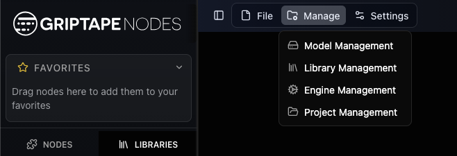

## The Project Management window

The Project Management window opens on the **project list**. Projects are shown as a tree: a child project appears nested under its parent. The project you're currently in is marked with an **Active** badge.

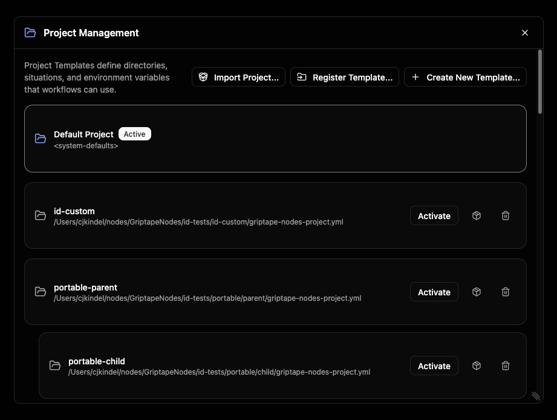

Two buttons in the top-right corner add projects to this list:

- **Register Template…**: point at a project file that already exists on disk and add it to the list.
- **Create New Template…**: make a brand-new project from scratch.

Click any project in the list to open its detail view, where you can review and edit it.

## Switching projects

Switching is the most common thing you'll do. You can switch from the Project Management window (click a project, then **Activate**), but the quickest way is the **project picker** in the workflow chooser.

The picker shows the project you're currently in. Open it to search the list and pick another; a checkmark marks the active one.

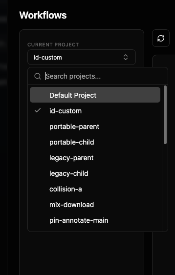

When you choose a different project, Griptape Nodes asks you to confirm. The dialog shows which project you're leaving and which you're moving to.

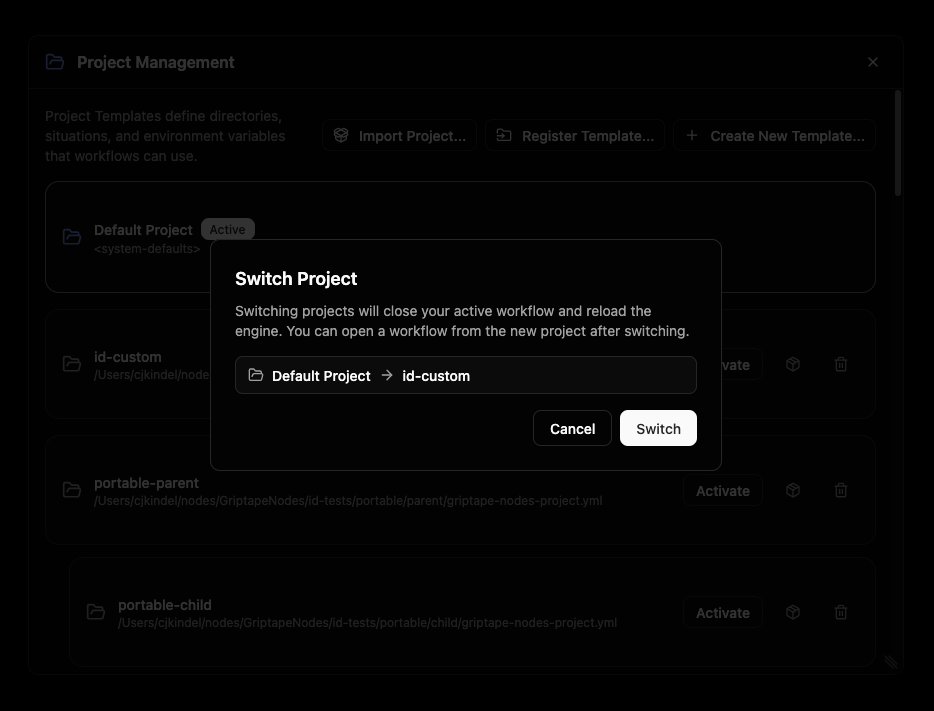

> **Switching reloads the engine.** Your active workflow is closed first (you'll be prompted to save if you have unsaved changes), and the workflow list refreshes to show the new project's workflows. After switching, open a workflow from the new project to keep working.

If the project you're switching to pins specific library versions, a **provisioning preview** appears first so you can review (and approve) any libraries that will be installed or changed before the switch happens.

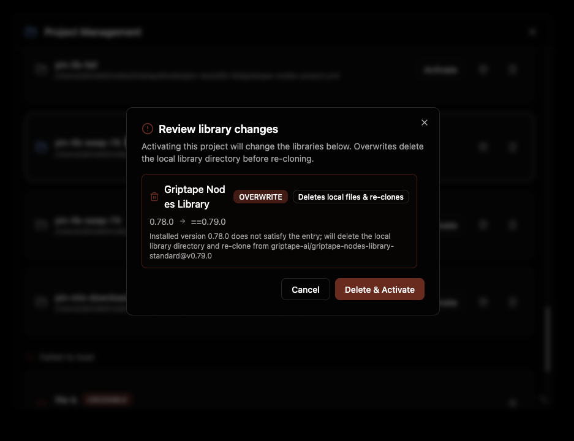

A progress indicator reads **Switching to <project>…**, and a **Switched to <project>** confirmation appears when it's done.

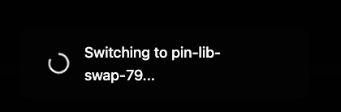

## Creating a project

Click **Create New Template…** to open the **New Project Template** dialog. For most projects you only need to fill in a name; everything else has a sensible default.

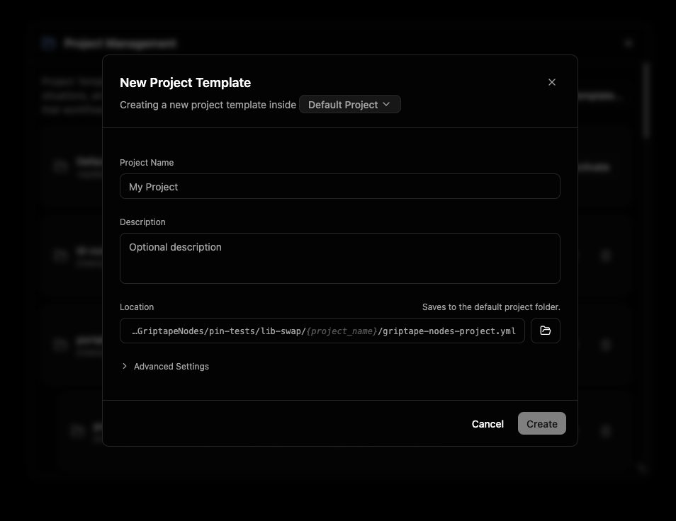

The subtitle at the top reads "Creating a new project template inside *Default Project*." That highlighted name is the **location**: a picker for which project's folder the new project is saved into. It defaults to your active project (or the Default Project). Click it to choose a different one.

Fill in the basics:

- **Project Name**: the human-readable name shown everywhere in the GUI. This is the only required field.
- **Description**: an optional note describing what the project is for.
- **Location**: where the project file (`griptape-nodes-project.yml`) is written. By default this is linked to the chosen location and shown as a read-only path that ends in `your-project-name/griptape-nodes-project.yml`, so it updates automatically as you type the name. To set a path by hand, click the path (or the folder button to browse); a **Reset** link relinks it to the default.

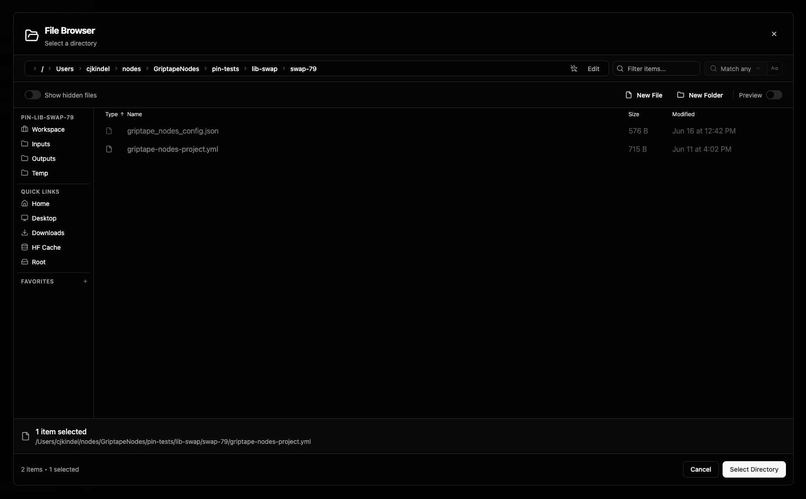

### Advanced Settings

Most artists never need to open this. Expand **Advanced Settings** to reveal:

- **Project ID**: a unique, permanent identifier for the project. It is generated automatically from the name plus a short random suffix, and you can leave it as-is. Click it to type your own (lowercase letters, numbers, and dashes; it must be unique). Once a project is created, its ID does not change.
- **Inherits settings from**: the parent project. A child project starts from its parent's setup and only stores the things you change. This is linked to the location by default, so choosing a location also sets the parent; pick **Default Project** here if you don't want inheritance. See [Projects](projects.md#parent-projects) for how inheritance works.
- **Workspace directory**: where the new project keeps its workflows and generated files. A new project defaults to `./` — its own folder — so it is self-contained. Change it to point elsewhere, or clear it to inherit the workspace from the parent project. (Shown only for current-schema projects; see [Schema versions](projects.md#schema-versions).)

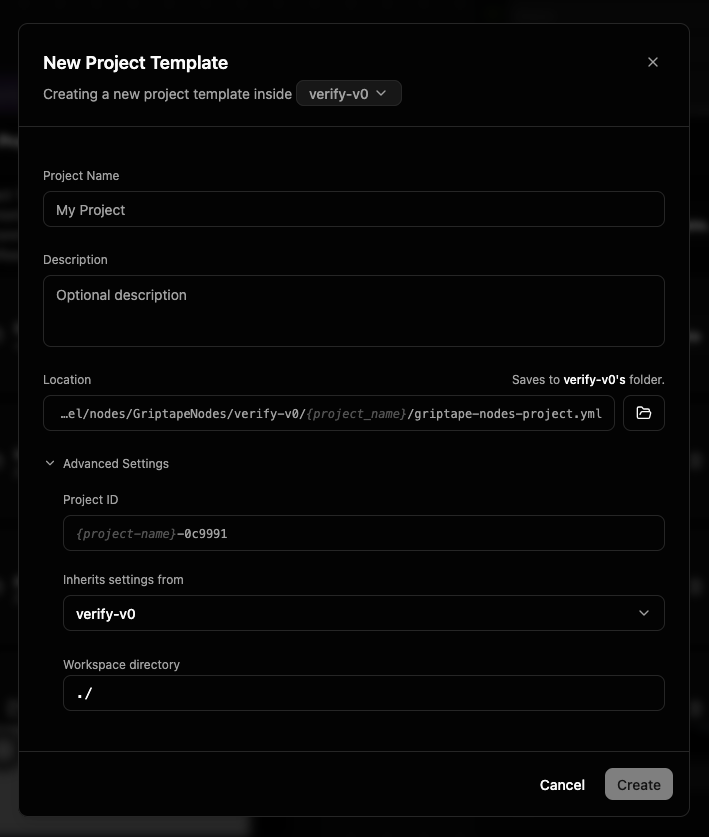

Click **Create**. A progress panel walks through saving the project, registering it with the engine, activating it, and finishing up. Creating a project makes it the active project, so the engine reloads (the same reload that happens on any switch); if you have an unsaved workflow open, you'll be prompted to save first.

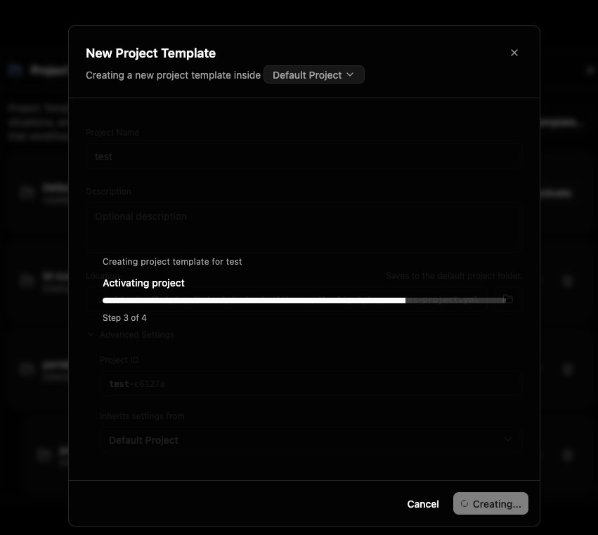

> If the location or parent project pins specific library versions, the same [provisioning preview](#switching-projects) shown when switching appears here so you can review and approve those libraries before the new project activates.

A **Project created** confirmation appears when it's ready.

## Viewing and editing a project

Click a project in the list to open its detail view. The header shows the project's name, its file path (with a button to copy it), and badges for **Active** and **Unsaved changes**.

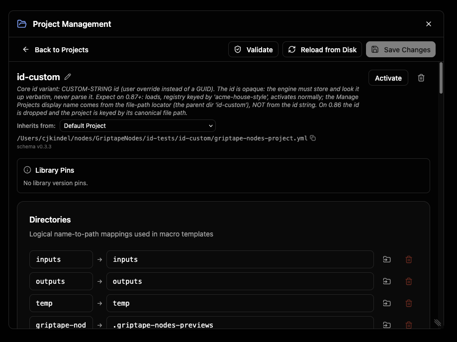

Use the pencil icon next to the name to edit the **name** and **description** inline.

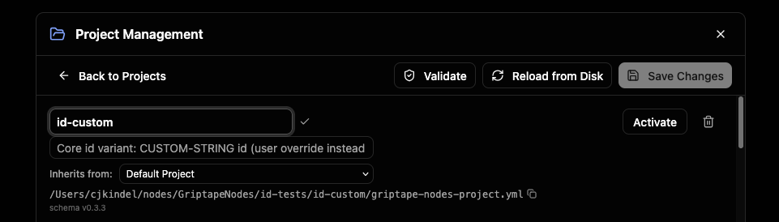

The **Inherits from** dropdown sets (or clears) the parent project. The detail view also surfaces the project's editable sections:

### Workspace directory

The **Workspace dir** field sets where this project's work is rooted: the folder that relative paths, outputs, and downloads resolve against. It is the highest-priority way to choose a workspace, overriding per-user and global settings.

Leave it blank and the project uses the workspace the engine works out from your settings; when blank, the field shows that **calculated** path as grey placeholder text, so you can see where the project's work will land without setting anything. Type a path to pin the workspace explicitly, or use the folder button to browse for one. Like Directories, it has a per-platform toggle to give the workspace different paths on Linux, macOS, and Windows.

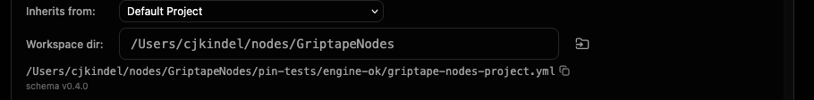

For the full reference, see [Workspace directory](projects.md#workspace-directory) and [Workspace](workspace.md).

### Directories

**Directories** map a short logical name (like `outputs`) to a real folder path. Workflows and nodes refer to the name, and the project decides where it actually points. Use **Add Directory** to create one, and the per-platform toggle on a row to give a directory different paths on Linux, macOS, and Windows.

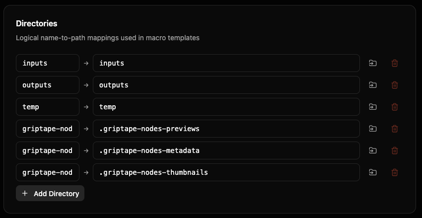

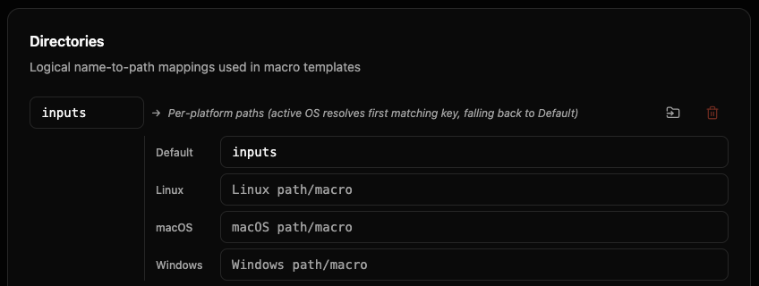

For the full reference, see [Directories](directories.md).

### File Extension Directories

**File Extension Directories** route files into folders based on their extension (for example, `png → images`, `mp4 → videos`). Expand the section to add or edit mappings.

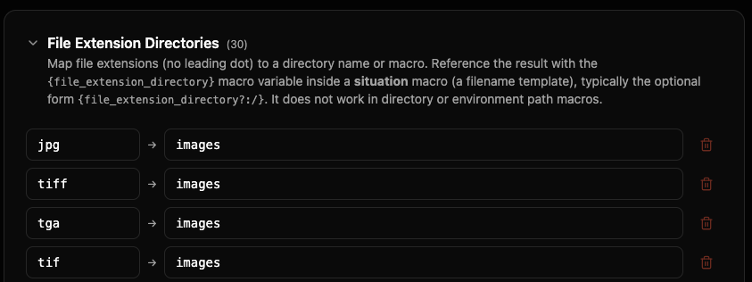

For the full reference, see [File Extension Directories](file_extension_directories.md).

### Environment

**Environment** is a set of custom key-value variables this project provides. You can reference them elsewhere in the project. Use **Add Variable** to add one.

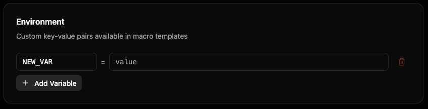

For the full reference, see [Environment & Builtin Variables](environment.md).

### Situations

**Situations** are named file-saving scenarios (for example, saving a node's output, or downloading a URL). Each has a path template (a macro) and a policy for what to do if a file already exists. Use **Add Situation** to define one.

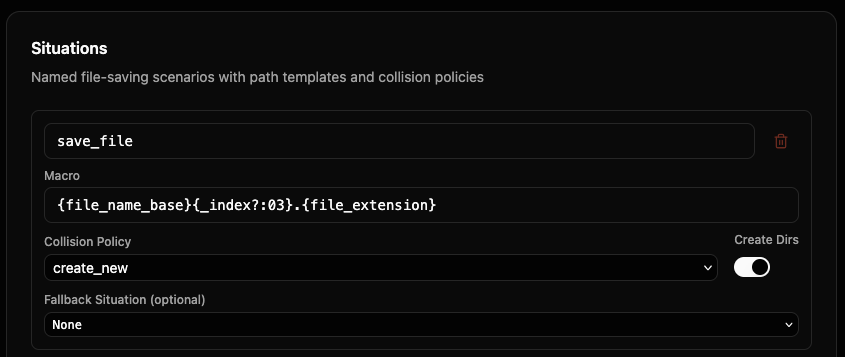

For the full reference, see [Situations](situations.md).

### Saving, validating, and reloading

A toolbar across the top of the detail view holds the actions for the project you're editing:

- **Validate**: check the project for problems without saving. Issues are listed with the field and a description; a clean check reports **Template is valid**.
- **Reload from Disk**: discard your in-window edits and reload the file as it is saved on disk.
- **Save Changes**: write your edits back to the project file. (Enabled only when there are unsaved changes.)
- **Upgrade schema**: appears only when the project is on an older schema version than the engine's current one. See [Upgrading a project's schema](#upgrading-a-projects-schema) below.
- **Back to Projects**: return to the list. If you have unsaved changes, you'll be asked to confirm before discarding them.

If a project pins specific library versions, a **Library Pins** panel shows what those pins are.

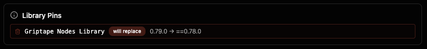

### Upgrading a project's schema

When a project was created against an older major schema version than the engine ships (for example a `0.x` project on an engine whose current schema is `1.x`), an **Upgrade schema** button appears in the toolbar. Upgrading re-bases the project on the current defaults: the settings you explicitly customized are kept, and everything you left at the old defaults adopts the new ones.

This is a **breaking** change — it can move where the project resolves its workspace, libraries, and saved files — so it is never automatic. A confirmation dialog spells out the consequences before anything is written; you can cancel. (Staying on an older version is fully supported; upgrade only when you want the new behavior.)

The button is disabled while you have unsaved changes — save or reload first, since the upgrade re-reads the project from disk.

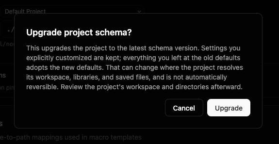

## Registering an existing project

If a project file already exists on disk (for example, one shared by your team), use **Register Template…** in the project list, browse to its `griptape-nodes-project.yml`, and it's added to your list. From there you can activate, view, or edit it like any other project.

## Removing a project

To remove a project from your list, open it and click the trash icon (or use the trash icon on its row in the list). Confirm in the **Remove Template** dialog.

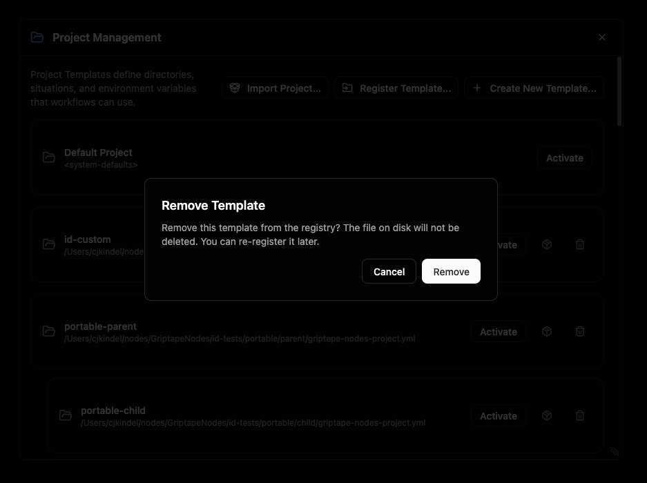

> **Removing only unregisters the project.** The project file on disk is **not** deleted, so you can register it again later with **Register Template…**.

## Exporting and importing projects

You can package a project into a single `.zip` file and move it to another machine, hand it to a teammate, or keep it as a backup. The package bundles the project file along with the libraries it depends on, so the project works on the other end without manual setup.

> **Secret values never travel in a package.** Things like API keys are referenced by name only. After importing, you set those secrets yourself in **Settings**; the import dialog lists exactly which ones you need.

### Exporting a project

In the project list, each project has a small package icon on its row. Click it, choose a destination folder, and Griptape Nodes writes `<project-name>.zip` there. A confirmation appears with the path, and if the project relies on any secrets, it also lists the secret key names whoever imports the package will need to provide.

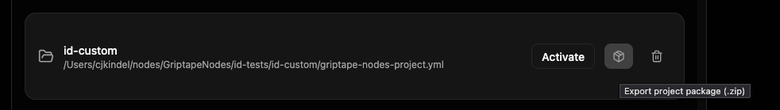

### Importing a project

Click **Import Project…** in the top-right of the project list and pick a `.zip` package. Before anything is extracted, an **Import project** dialog shows you what's inside:

- **Package**: the project's original name.
- **New project name** (optional): rename the imported copy. Leave it blank to keep the original name. Renaming is handy for branching or duplicating a project.
- **Libraries**: each bundled library, tagged **bundled** (a full copy travels in the package) or **referenced** (re-downloaded on import).
- **Secrets to set**: any secret keys this project needs that aren't already set in your environment. Set these in **Settings** before running the project.

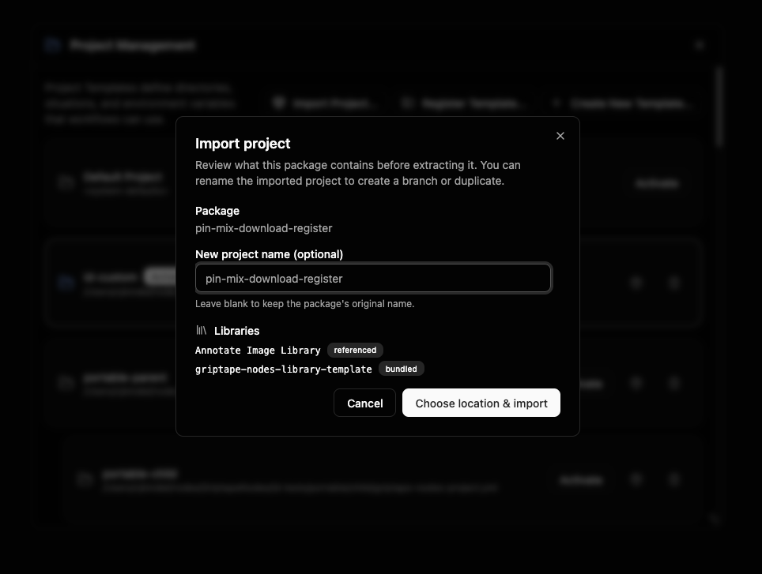

Click **Choose location & import**, pick the folder to extract into, and the project is registered in your list. A confirmation shows where it landed (and reminds you of any secrets to set). The imported project is added to your list but is **not** activated automatically; switch to it when you're ready.

## The Default Project

Griptape Nodes always includes a built-in **Default Project**. It's read-only: you can view it, but you can't edit or save it. When you open it, a banner explains this and offers a shortcut to **Create a custom project** so you can define your own directories, situations, and variables.

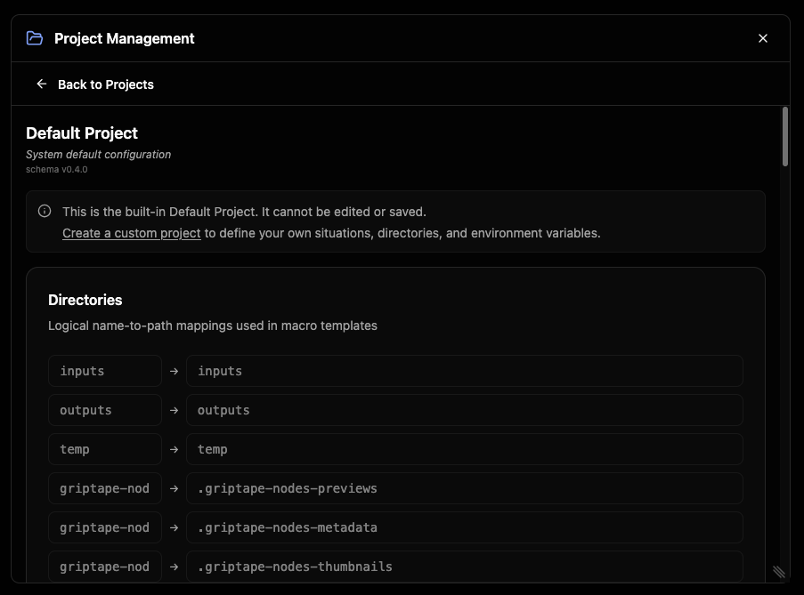

The Default Project is also the project you're in when no other project is active.

## Seeing a project's workflows

The workflow chooser only shows the workflows that belong to the project you're currently in, so switching projects also switches which workflows you see.

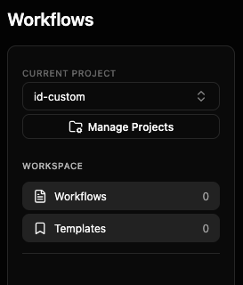

## Where to go next

- [Project overview](index.md): how the pieces fit together
- [Workspace](workspace.md): the root working context and how relative paths resolve
- [Projects](projects.md): the project file format, parent projects, and the merge model
- [Version Pinning](version_pinning.md): pin a project to an engine version and to specific library versions
- [Macros](macros.md): the template syntax used in situations and directories
- [Directories](directories.md), [Situations](situations.md), [File Extension Directories](file_extension_directories.md), [Environment & Builtin Variables](environment.md)
