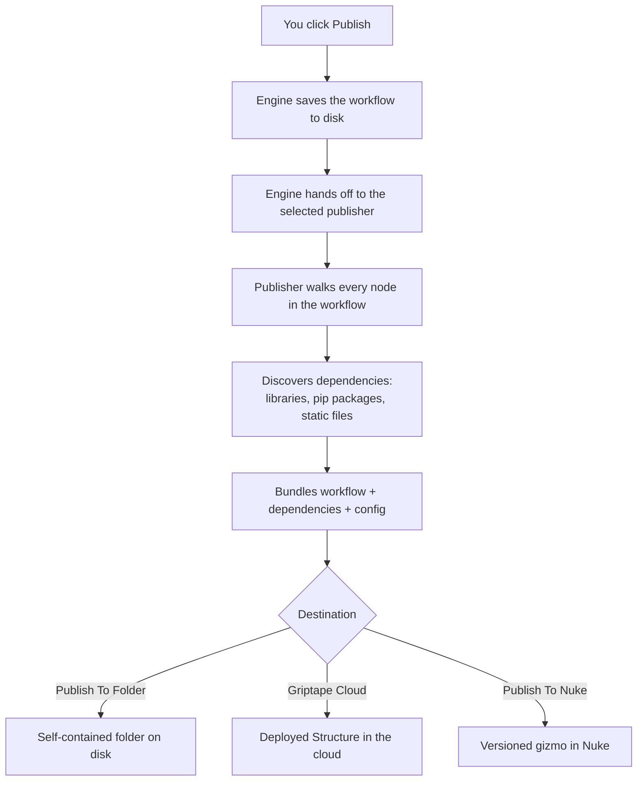

# Publishing a workflow

Publishing takes a saved workflow and hands it to a *publisher* that bundles it —
together with the libraries, Python dependencies, configuration, and files it
needs — and sends it to a destination. Where the workflow ends up depends on the
publisher you choose: one publisher writes a self-contained folder to your disk,
another deploys the workflow to Griptape Cloud, another installs it as a gizmo in
Foundry Nuke, and a node library can provide its own publisher for any other
target.

This page explains what's common to every publisher — the publish lifecycle and
how dependencies are discovered — and how the publishers you'll encounter differ.
It is for anyone who publishes a workflow. If your published workflow is missing
a media file (an image, audio clip, video, or text file it loads), skip ahead to
[Static files: the known gap and the workaround](#static-files-the-known-gap-and-the-workaround).

## Publishers

Publishing itself is built into the engine, but the *publisher* — what actually
packages your workflow and where it sends it — is provided by a node library. Any
library can register a publisher, so the list you see depends on which libraries
are installed. Several publishers ship with Griptape libraries:

| Publisher             | Provided by            | Where the workflow goes                                                                   |
| --------------------- | ---------------------- | ----------------------------------------------------------------------------------------- |
| **Publish To Folder** | Griptape Nodes Library | A self-contained folder on your disk that you can run headlessly.                         |
| **Griptape Cloud**    | Griptape Cloud Library | A deployed Structure on Griptape Cloud that you can run and integrate remotely.           |
| **Publish To Nuke**   | Foundry Nuke Library   | A versioned `.gizmo` installed into a Foundry Nuke installation, runnable from Nuke's UI. |

When you publish, you pick which publisher to use. Each publisher decides what
options it needs from you — Publish To Folder asks for an output directory;
Griptape Cloud reads its target from your configured cloud bucket and the
workflow's Griptape Cloud Start Flow node; Publish To Nuke asks which Nuke
installation and gizmo directory to install into, and whether to update an
existing version or publish a new one.

## Before you publish

- **Save your workflow first.** Publishing operates on the workflow as it exists
    on disk. An unsaved workflow cannot be published — save it, then publish.
- **Choose a publisher.** Pick the publisher for where you want the workflow to
    go (see the table above). If only one library provides a publisher, it is
    selected for you.
- **Fill in the publisher's options.** The publish dialog shows whatever fields
    the selected publisher asks for — for example Publish To Folder's output
    directory. Fields are pre-filled from your last publish where possible.

## What happens when you publish

Regardless of which publisher you pick, the lifecycle is the same. The engine
saves your workflow, hands off to the selected publisher, and the publisher walks
the workflow to discover and bundle everything it depends on before delivering it
to its destination:



As it works, the publisher reports progress with messages such as
`Copying libraries...` or `Deploying workflow to Griptape Cloud...`, so you can
watch the bundle come together.

## What ends up in the bundle

Every publisher assembles the same core ingredients, because a workflow needs all
of them to run anywhere:

- The **workflow file** itself.
- The **node libraries** the workflow references, including transitive
    dependencies.
- **Configuration** telling the engine which libraries to load.
- An **`.env` file** merging your workspace environment with the secrets the
    workflow needs.
- A **project template** so directory macros and situations resolve at runtime.
- **Python dependencies**, pinned to the engine and library versions the workflow
    was built against.
- A **Hugging Face model download step**, when the workflow uses such models.

What differs is the *shape* of the delivered result:

- **Publish To Folder** writes these into a folder on your disk, plus a `run.py`
    entrypoint and a `README.md`. The README documents installing dependencies
    (`uv sync`) and running the workflow (`uv run python run.py --help`).
- **Griptape Cloud** zips these into a Structure package, uploads it, and creates
    or updates a Structure in your account. It can also create a webhook
    integration and generates a separate *executor* workflow you can use to invoke
    the deployed Structure. On success it returns a link to the Structure in the
    Griptape Cloud console.
- **Publish To Nuke** installs these as a versioned `.gizmo` (plus a runner
    script) into the chosen Nuke installation's gizmo directory, and adds a
    Griptape submenu to Nuke's toolbar so you can run the workflow from inside
    Nuke. Publishing the same workflow again either updates the current version or
    adds a new one, and outputs are routed to land next to the Nuke script.

## How dependencies are discovered

The publisher walks every node in your workflow and asks each one what it depends
on. It aggregates three kinds of dependency across the whole workflow:

- **Libraries** — the node libraries in use, by name and version. These are
    always collected, along with any libraries they depend on.
- **Python (pip) dependencies** — the Python packages each referenced library
    declares in its manifest, pinned so the bundle reproduces the environment the
    workflow was built against.
- **Static files** — media and data files a node reads from your project (images,
    audio, video, text, and so on). These are only bundled **if the node declares
    them** as dependencies.

That last point is where publishing can surprise you, and it applies to every
publisher equally.

## Static files: the known gap and the workaround

!!! warning "Referenced files can be missing from the bundle"

    A static file is only included in the bundle if the node that uses it
    *declares* it as a dependency. Not every node does this yet. If a node loads a
    file but doesn't declare it, that file is **left out**, and the published
    workflow breaks when it tries to read a file that isn't there. This is true
    whichever publisher you use.

Until every node declares its file dependencies, the reliable workaround is to
route the file through the **`SelectFromProject`** node, which ships with the
[Griptape Nodes Library](https://github.com/griptape-ai/griptape-nodes-library-standard):

1. Add a `SelectFromProject` node and set its **selected path** to the file (or
    directory) you want to include.
1. Connect its `project_path` output into the node that consumes the file.

`SelectFromProject` explicitly declares its selected path as a static-file
dependency, so the publisher always bundles that file. Feeding your file through
it guarantees the file travels with the published workflow.

!!! tip "Files inside your project stay portable"

    When the selected file lives inside your project, `SelectFromProject`
    resolves it to a project-relative *macro* path rather than an absolute path.
    That keeps the reference valid after the bundle is moved to another machine or
    deployed to the cloud.

**When do I need this?** Use `SelectFromProject` for any file loaded from your
project that doesn't show up in the published bundle — for example an image,
audio clip, video, or text file that a node reads but that goes missing after you
publish.

## For library authors

Publishing is extensible: a node library can provide its own publisher targeting
any destination, and its nodes can declare exactly which files they need.

**Registering a publisher.** A library subclasses `AdvancedNodeLibrary` and, in
`after_library_nodes_loaded`, registers a handler for `PublishWorkflowRequest`
via `LibraryManager.on_register_event_handler(...)`. The registration also names
the library's own start/end flow node types (and, optionally, a
`get_publish_options` callback that supplies the dialog fields). The handler
becomes a selectable publisher in the publish dialog. Several reference
implementations exist:

- **Publish To Folder** — the
    [Griptape Nodes Library](https://github.com/griptape-ai/griptape-nodes-library-standard)
    (`griptape_nodes_library_advanced.py`), which supplies publish options for the
    output directory and packages to a local folder.
- **Griptape Cloud** — the
    [Griptape Cloud Library](https://github.com/griptape-ai/griptape-nodes-library-griptape-cloud)
    (`griptape_cloud_library_advanced.py`), which registers its own
    `GriptapeCloudStartFlow`/`GriptapeCloudEndFlow` node types and deploys to the
    cloud rather than to disk.
- **Publish To Nuke** — the
    [Foundry Nuke Library](https://github.com/griptape-ai/griptape-nodes-library-nuke)
    (`nuke_library_advanced.py`), which registers `NukeStartFlow`/`NukeEndFlow`
    node types, offers a multi-field dialog (with dependent and versioning
    fields), reuses the shared packager for the common ingredients, and then does
    its own Nuke-specific installation.

A publisher is free to deliver its bundle however it likes; the engine only
requires it to handle `PublishWorkflowRequest` and return a result. Publishers
that need to bundle the common ingredients can reuse the engine's
`WorkflowPackager` (as the Folder and Nuke publishers do) rather than
reimplementing that logic.

**Declaring node dependencies.** The permanent fix for the static-files gap above
is for each node to declare the files it uses, which benefits *every* publisher.
Override `get_node_dependencies()` and add the file to
`NodeDependencies.static_files`. When a node does this, publishers bundle its
files automatically and the `SelectFromProject` workaround is unnecessary:

```python
def get_node_dependencies(self) -> NodeDependencies | None:
    deps = super().get_node_dependencies()
    if deps is None:
        deps = NodeDependencies()
    value = self.get_parameter_value("path")
    if value and isinstance(value, str):
        deps.static_files.add(value)
    return deps
```

Always call `super().get_node_dependencies()` first so library and widget
dependencies are preserved, then add your own. See the
[Comprehensive Guide](../developing_nodes/comprehensive_guide.md) for the full
node-development reference.
